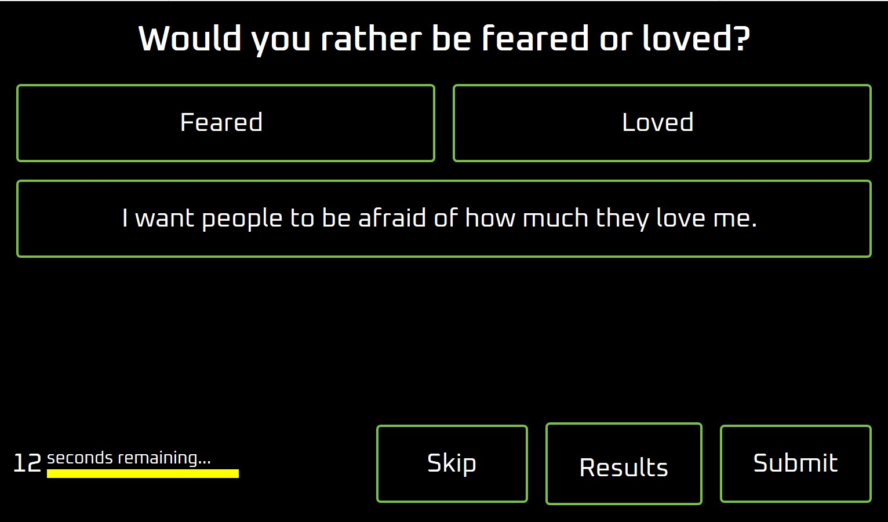
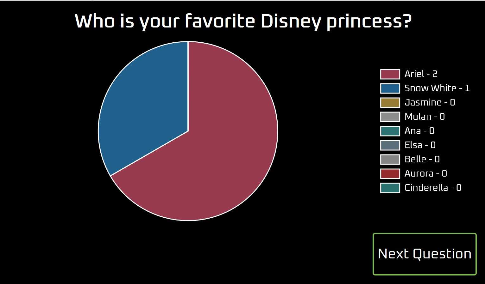

--- 
date: "2020-03-14"
title: "The Pi-plate: The Nameplate Application"
tags: ["pi-plate", "angular"]
type: "blog"
---

In my previous posts, I've introduced my [pi-plate project](https://www.honlsoft.com/projects/pi-plate/) and described how I set up a Raspberry Pi to work as a kiosk.   In this post, I will briefly describe the application I built. 

I put the application I wrote up on [Netlify](https://www.netlify.com) to see, and the source code for the application is on [GitHub](https://github.com/jerhon/pi-plate).  [A link for the running application is here.](https://hs-pi-plate.netlify.com)

The main application utilizes a few different technology stacks to build and deploy.  These are:
* Angular
* Nginx
* Docker

This blog will focus on the Angular application.   I will write about the nginx and docker configuration in a future post. 

# The Application

The application is a web application written in Angular.  I chose this as a simple way to produce an interactive interface for the kiosk and reuse existing web development practices and libraries.  

The application consists of several angular components navigated between by button presses through the Angular router.

* The nameplate component
* The question component
* The poll-results component

These utilize an application page component which defines a common layout, and a service which is used for retrieving and storing required data for the application.

# The Application Page Component

All the pages in the application consist of a similar layout.  They have a header, some content in the middle, and a set of actions that are buttons on the bottom of the page.  In order to avoid duplication, I created a single component for reuse of this layout.

There are a few key pieces to this to get it working correctly.
* Using ng-component with select to include content in sections within the page.
* Designing a reusable full page flex-box layout.

## Using Flexbox to Create a Full Page Layout

Flexbox is a great technology to use on modern browsers for laying out content.  Flexbox allows building a sequence of boxes on a page in either a row or column.  It can control aspects such as the size of the individual flex items in the flex box, whether they grow, shrink, wrap, etc.

All pages in application, are three boxes stacked vertically on top of each other in a flexbox layout.

```
|=================|
| A Title Area    |
|=================|
|                 |
| Content         |
|                 |
|=================|
| An actions area |
|=================|
```

All the areas fit into a single ```<div>``` container element which defines the flexbox.  The key ingredient here is to prevent overflow on the container and set the height to the height of the viewport.  This will squish the rest of the contents

The title area fits into another ```<div>``` which does not allow grow or shrinking, and it's flex basis is set to automatically be the height of it's content.

The content area fits into another ```<div>``` which grows to fill any unused space and is set to automatically scroll when the content becomes to big to fit within the space.

The action are fits into another ```<div>``` which like the title doesn't allow growing or shrinking but fits to the height of it's content.


## Including Content with ng-component and select

When creating a reusable component as a layout, components built from it often need to place content within the layout.  For example, this layout has a number of actions that can be included in a space at the bottom of the page.  The pages that implement this layout need to be able to provide the set of buttons to implement those actions.

In angular, this can be accomplished via the ```ng-component``` with  ```select```.  This will look at child elements, and insert them in place of the ng-component if they match the ```select```.

For example, in my app-page component, I have divided it into three sections.  We'll look at portion of the page for content.

```xml
...

<div class="actions">
    <ng-content select="[page-actions]"></ng-content>
</div>

...
```

This ng-content is allowing users of this component to insert elements within that spot in the page.  For example to insert an anchor &lt;a&gt; html tag:

```xml
...

<app-page>
    <a page-action>Insert me in the content area of the page!</a>
</app-page>

...
```

The paragraph gets inserted into the are with the ```ng-component [page-content]``` selector within the main div.  

This is a really powerful tool for building reusable layouts, and a major advantage modern web development frameworks such as angular provide.

# Nameplate Component


The nameplate component is the landing page for the kiosk utilizing the application page layout component.  It is the most straightforward of any of the components.

In the title area of the layout it contains my name.

In the content area of the layout, a picture of me, a link to my linked in profile, a link to my website, and my address in the building where I work.  This also contains a timer component which switches to a random polling question after 30 seconds have elapsed.  A button on the bottom let's someone skip into a random polling question immediately.   The navigation between nameplate to the question component utilizes Angular routing.

The timer component was built utilizing the rxjs timer creation operator.  This creates a timer which emits an event on an observable after a certain period of time.  There are many options on this operator to control when the event fires.  In this case, the event will fire after 30 seconds.

```
timer(30000).subscribe(() => console.log('Timer!'));
```

# The Question Component



The question component provides the page for asking a poll question.  It utilizes the app page component for the overall layout. The question is the title for the page, and potential answers are the content. A few options are actions at the bottom of the page:  Skip the question, see the results, or submit the answer for the question.  It also has a timer that provides a 30 second countdown, if no answer is provided within 30 seconds, the application will navigate back to the nameplate component.

The questions are retrieved from the survey service, and a checkbox animation displays on the right of each answer when it is selected.  When an answer is selected, the submit button will record the answer.

The title was straight forward, it's just a block of text.

The question area was designed as a flex box with the questions occurring in a row with wrapping.  When the button is clicked it updates the 'selected' answer, and a checkbox displays.  The checkbox is an SVG that uses css animations when shown.  The checkbox was a snippet I reused from css animation examples on the web.

A separate component was built for the countdown.  The countdown contains a number that counts down from 30, a message and a bar that increases in width until it matches the entire width of the countdown component itself.  The countdown is using another ```timer()``` creation operator from rxjs to update the time in the component and increase the width of the bar.  The countdown component has an output observable that fires once the countdown has elapsed which allows the parent component to perform it's logic.  For the question component specifically, this navigates back to the nameplate.

# The Poll Results Component



The results component is based off the app page component again.  The title is the question with results.  The content contains a chart of the potential answers.  Again at the bottom are a few actions.  At this point, just the ability to move to the next question.

The title again is just a block of text.

The content is utilizing ```Chart.js``` and specifically an angular wrapper around it named ```ng2-charts```.  This is a really great library and provides a number of options for the chart.  I just had to format the data properly and provide it as a data set to the component, and it provided me a beautiful pie chart.

The "Next Question" just routes to next question via the "Question Component".

# The Survey Service

The survey service provides the ability to get questions, record responses, and save them.  This is utilized by both the question component and poll results component.

The main work behind this service was providing a way to store and retrieve the questions and answers.  The questions are stored in a json file in the repository.  Typescript provides the facility to import a json file and utilize it with strong typing.  This enables modern development conveniences IDEs provide. To use this requires setting the ```resolveJsonModule``` to true in the ```tsconfig.json``` for the project, and importing the json file as if it were a typical module via an import statement.

The responses for the questions are stored in local storage for the browser.  Each question is stored as a key in local storage, and the value being a json object mapping an answer to it's number of responses. The downfall with local storage for my kiosk is that the questions get reset when the kiosk is restarted, but for this project, that's fine.

# Wrapping Up

This was a fairly simple web application.  Thankfully there are frameworks such as Angular to provide an easy way to build modern web experiences.
