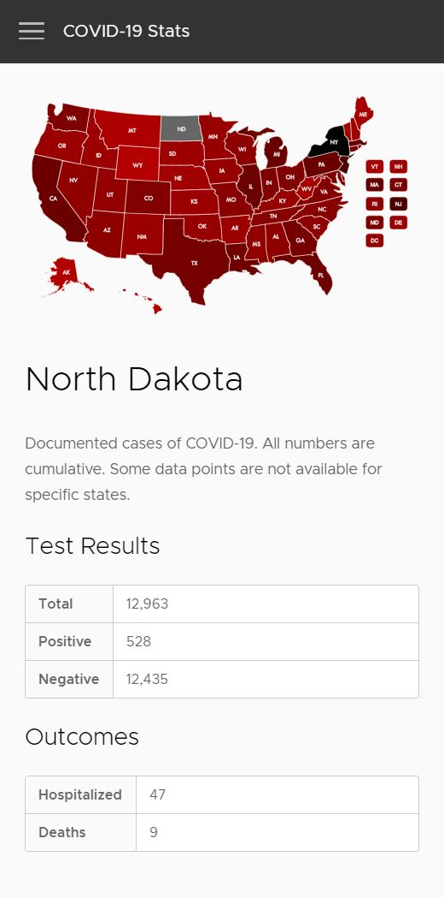

I've been working with Angular as my primary platform for building web applications for over a year now. I love it. I've typically used [Angular Material](https://material.angular.io/) as my UI component framework. However, there are several other good frameworks out there to build high quality applications.

One of these that's always intrigued me has been the [Clarity Design](https://clarity.design/). It's an open source framework that's supported by VMware. I finally decided to give it a try for a small web application.

The application I'm building is a COVID-19 dashboard. It uses open APIs from [The COVID Tracking Project](https://covidtracking.com/) to retrieve some simple data and present it for U.S. cases of COVID-19.

Here's a screenshot of the interactive map:

Click on a state and the information will appear to the side.

Here's a screenshot of the interactive map in a mobile responsive view:

## Clarity Design

The Clarity Design framework works great. The header on the top of the page is responsive out of the box. As it shrinks, it provides a button to the left of header where a break-out side-nav will toggle open and closed. It automatically shifts navigation items in the navigation space in the title the side nav that breaks out.

The Clarity Design framework also provided a number of built in stylings that made building out the rest of the application simple, such as the table. The typography looks great, and there are a number of CSS classes to control it. The framework also provided a responsive grid layout similar to what Bootstrap provides.

## Interactive US Map

The US map was slightly more difficult to implement. I looked for angular components that had interactive US maps, but there aren't many out there. I decided to build something simple myself.

First was finding an SVG representation of the US. [MAPSVG](https://mapsvg.com/maps), a WordPress plugin, has several SVG maps it provides free of use that were adequate. The key to selecting an SVG map was that each state needed to be an SVG path in order to allow mouse interaction. The mouse or pointer input for each state could then be added by inspecting the children of the SVG on the page which are paths and inserting logic on click.

The US map was built out as a separate component, so I can reuse it in later projects, and potentially extend it to do more. It was amazingly simple to create, and much of that has to do with how Angular makes web applications so simple to build.

The downside to the SVG map is that it won't work on Internet Explorer as expected as it does in other browsers. However, if you're still running Internet Explorer, it's time to switch! I'm not planning on improving the application to work with archaic web browsers.

I set the map has a color grading based on positive test results. Deducing a meaningful color scale for the colors across the US map was tricky. I originally tried a purely linear scale. However, the number of cases are highly disproportionate from New York to other places in the U.S. This made New York a single color, and other states with little variation. I tried a logarithmic scale, but the colors looked too similar between states. It looked like everywhere was really close to New York for a case count. I settled on a combination of the two, which allowed for a color variation that I feel like gives some help determining where the main hot spots are, but also some differentiation for states on the lower spectrum of the scale.

## Summary

It was a fun little project that took a few free week nights and time on Saturday(It seems like free time is easier to come by now-a-days). I loved the Clarity Design framework, and the SVG approach for the US map is something very useful I'm going to use for data visualization in the future.

The source code is available on GitHub. [COVID-19 Stats on GitHub](https://github.com/jerhon/covid-19-stats).
