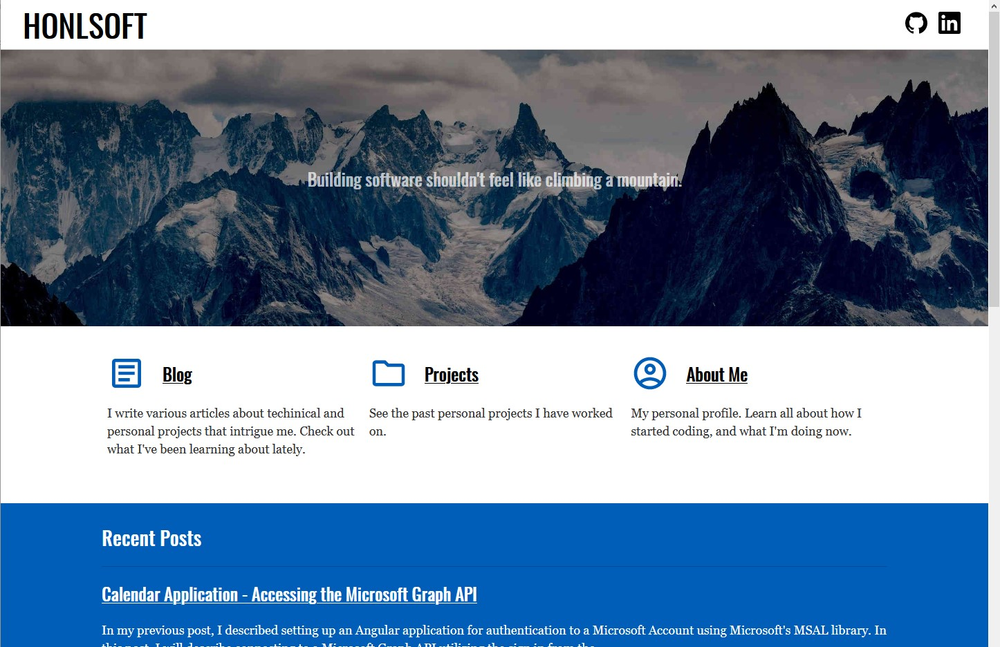

Over the past year or so, I've been trying to write more technical blogs on this webpage.  Mainly, I'm trying to improve my communication skills and document some of the various side projects I've been working on in my free time.

I used a static site generator named Hugo to build this site.  It worked fine, but it just wasn't as productive as an environment as I hoped. It didn't have as good of IDE support.  I ended up manually crafting templates in a code editor without proper syntax highlighting and it got tricky at times.  The language was also lacking.  The documentation was also somewhat cryptic.

However, over the past few months, I wanted to do more, and spend less time with the tooling.  I had discovered Gatsby some time ago, but hadn't yet gotten to the point of wanting to take the plunge into a different static site generator.  Eventually, as I started refreshing my site, I decided something had to change.  So, I decided to give Gatsby a chance.  I started playing around with it in my free time, and really became impressed with how easy it was, and how fast of a static site it built.  Picking Gatsby was somewhat strategic as well.  I've started a new job, and we're looking at using React as a potential framework to port some old AngularJS applications.  It's been a few years since I have used react, so I needed to brush off the dust.  I figured this would be a fun project for my time outside of work, and it would have positive impact there too.

# Gatsby and React

Gatsby is a static site generator that utilizes React for it's view engine.  Everything I write that someone will see ends up being a React component.

Gatsby supports both writing full pages as react components, and creating data driven templates from react components. React also has a huge ecosystem of developers.  With the ecosystem comes great IDE tooling and external knowledge base to rely on.  Given that I had worked in it a few years prior, some prior experience to help me out.

# Gatsby and Data

Gatsby also has a very robust mechanism for data ingestion.  It builds a database as part of it's build process and fronts it with a GraphQL interface to allow querying of this data.  It provides and supports plugins in order to add data to this internal database or connect to other databases or systems.

For an example, one plugin allows for the ingestion of markdown files.  The plugin transforms the markdown to HTML and provides metadata available via GraphQL.  A template component written in React can have a query which retrieves that data via GraphQL and use it in the props to render. 

There is some cool trickery going on with Gatsby to allow this. This doesn't mean that there is a database that's queried when the web site is deployed. The GraphQL query gets extracted from the javascript abstract syntax tree by a transpiler and run at build time for the static site and gets stored to the side (usually as a JSON file).  When the static site runs, it can read the data from the JSON file.  I'm not sure how much of the data ends up getting pre-rendered in the HTML view vs how much gets put in the JSON files.  It's part of the magic that Gatsby provides, and most of the time it just works.

# Gatsby's Other Capabilities

Gatsby does a whole lot of other cool things too.  It has plugins to handle and transform images, it can pre-fetch data for the website to minimize load times, provides support for PWAs, Wordpress, and MANY more.

And... it supports typescript out of the box.  I love typescript!

Gatsby isn't the end all be all for web development though.  It has it's niche, and that is primarily content driven static sites.  I don't anticipate using it as a framework for much else beyond that.

# The Results

I wanted to clean up the page somewhat and have a minimal design with only a few colors.  You can see what it looks like since you're here already, but here's a picture of it for site crawlers to pick up.

Making a site "look good" is the most subjective part of web development.  Overall, I'm pleased with the initial progress.  I will likely be updating portions of it as I go and potentially adding more design / styling.  However, I intentionally used a minimal design to keep it fast.

Let me know what you think of it by commenting on the LinkedIn post.  If you notice any issues, please log them in the [GitHub repository](https://github.com/jerhon/honlsoft-v2)!