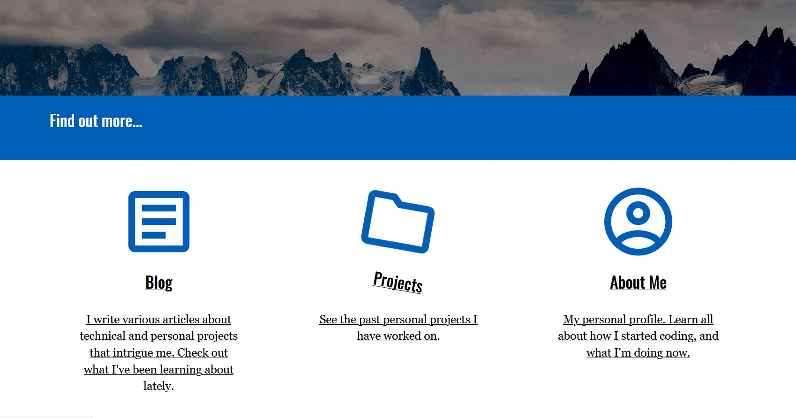

I've been watching a few pluralsight courses on CSS transitions lately.
I've been observing other sites and have noticed a lot of little transitions that improve the overall feel of the site.
Things like rotating elements, fading in text, or motion to provide simple animations can add a new level interactivity.
CSS transitions are a great tool to add these, and inject some life into webpages.

In this post, I'm going to introduce an extremely simple usage of the transition CSS property.
In another post for this series, I'll talk about the intersection observer and how it can be used to trigger these.

## CSS Transitions

CSS transitions are a simple way to implement changes to a single property over time as opposed to having them occur immediately.
For example, if an element is changing from being transparent to fully visible through the opacity property this can be done over time with a transition.
Another common example are changes through the transform property such as scaling, rotating, or moving an element.

CSS transitions are fairly easy to use.

Transitions generally have 4 parameters to define them.

1. The property the transition should occur over
2. The amount of time the transition should be over
3. How to apply the transition over time also known as the timing function
4. A delay before a transition should occur (not included in my example)

Here's a sample transition that would be over a transform.
It would apply over the transform property and perform a linear transition over 400ms.

```css
.transitionElement {
  transition: transform 400ms linear;
}
```

In order to trigger the transform to occur, the transform property would need to be changed.
This can be triggered by having two classes with differing values.
Another could be triggering a property change on a CSS selector such as :hover or :focus.

For example, to slightly rotate an element when it were hovered over, the CSS would look like this.

```css
.element {
  transition: transform 400ms linear;
}

.element:hover {
  transform: rotateZ(15deg);
}
```

Here's a sample codepen that illustrates this.

https://codepen.io/jerhon/pen/XWdxOML

Another example is fading text in or out. This can be done via a transition on the opacity property.

https://codepen.io/jerhon/pen/OJNdyvE

## CSS Properties

Not all CSS properties are able to be used in a transition.
Common ones I've seen used in tutorials are the transform property, height, width.
For example, performing a transition on height to have a drop down menu open.
[There is a full list available here.](https://developer.mozilla.org/en-US/docs/Web/CSS/CSS_animated_properties)

There are a few things to be careful of.
The different properties will have different performance characteristics in the browser.
Transform is perhaps the best property as many of its functions are implemented using hardware acceleration.

There is also an option to animate all properties.
While it makes it very simple, be careful with this.
That's telling the browser to watch all the properties of an element for a change.
That can be VERY expensive performance wise!
A good rule of thumb is to only apply transitions to the properties which they should take place over.

## CSS Transition Timing Function

The timing function determines how to apply the change to the property over time.
Common ones are linear, ease-in, ease-out.
Linear applies the change uniformly over time.
Ease-in slowly applies the change and accelerates the change over time.
Ease-out applies the change fastest at the beginning and slows down over time.

There are many others, but it's easier to see and experiment with them.
A great resource for timing functions is [easings.net](https://easings.net/) which gives several curves, and a visual representation of what they look like.

## Browser Support

Most major browsers support transitions from IE 10+.
As always, make sure to do some cross browser testing to be sure everything works as expected.

## Other Examples

You can see some animations in action on the [Honlsoft homepage](https://www.honlsoft.com).
There are links that have a slight rotation that hovers.

I also had set up later in the page text that moves in from the right page as it comes into view for recent posts.
I used transitions coupled with an "Intersection Observer".
I'll detail how to work with that in a future post.


