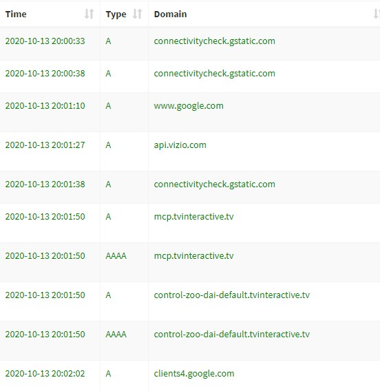

Recently, I updated pi-hole on my Raspberry Pi to version 5.
[It's been several months since I originally installed it on my Raspberry Pi.](./2020-02-11-pihole)
After some great results having it block ads, I decided it was time to have it act as the DHCP server for my home network too.
I can now do fun things like reserve IP addresses to specific devices, and add insert custom DNS entries on my local network.
I have printer.honlsoft.local resolving to my local network printer and can add other rules too.

This is great, but while I was tinkering around with it, something caught my eye.
There was a device on the network that had an awful lot of DNS queries.
It took a long time to figure out what the device was.
The device wasn't providing a hostname.
I had the assigned IP address, MAC address, and a few query logs to find out what was causing it.

Here were some of the records.

I guessed it was a TV based on the domain names.
After a few Google searches, I narrowed it down to a specific brand of TV.
Then I checked the IP of those TVs in their settings and found the matching TV.

Why would my smart TV be connecting so much even when I'm not using it to watch anything over the network?
It turns out a lot of the queries are connectivity checks.
[However, I also found this ominous setting about collecting advertising data.](https://support.vizio.com/s/article/Smart-Interactivity-Broadcast-Interactivity-FAQ-How-to-turn-Smart-Interactivity-Broadcast-Interactivity-on-or-off)
Well, that doesn't make me feel to great.

I'm not sure what the specific method this smart TV is collecting its advertising data.
Some brands of these smart TVs take a small subset of pixels from the screen and send them back as a sort of "thumbprint" of what's being watched.
They can't recreate what's being displayed from the thumbprint alone, but if they can match the thumbprint to some image they have, and can determine what it is.
An example where this type of match would occur from a television show, or a network logo on the screen.
Hence, they can determine what you're watching and sell that information to places such as networks.

I've turned off the tracking now, and plan on blocking a few extra DNS queries from the TV.
[C-net has a great article explaining hot to disable this sort of tracking across multiple brands of TVs even though it's a bit dated.](https://www.cnet.com/how-to/your-tv-is-probably-tracking-you-heres-how-to-stop-it/)
Lesson learned.

Pi-hole has been a great addition to my home network.
Without it, I would have never realized the TV was tracking me.
