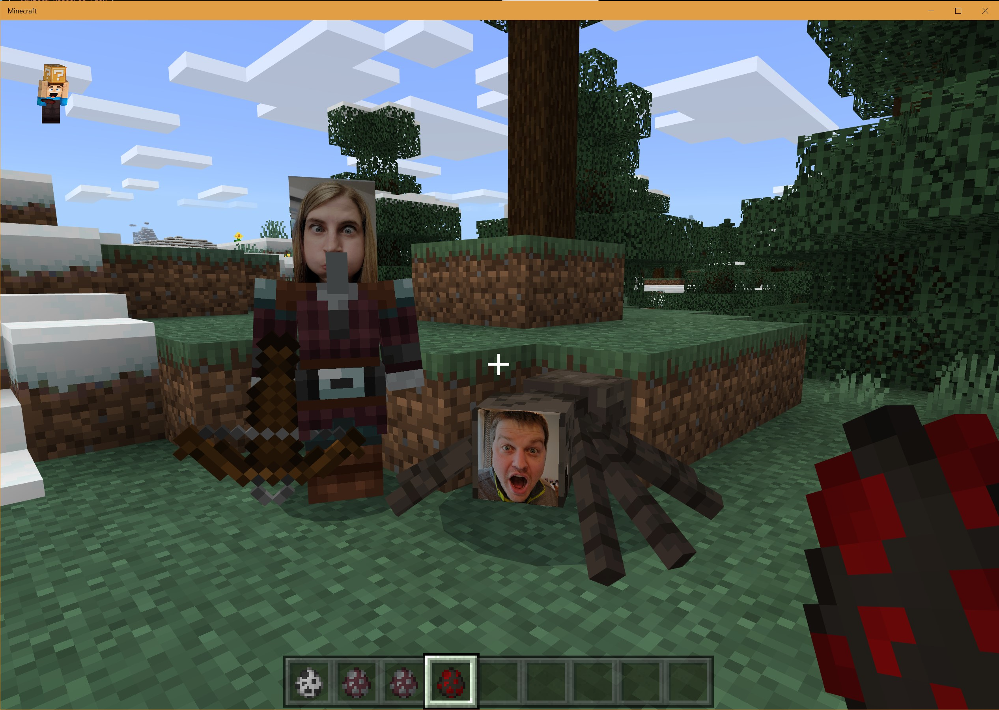

Family Minecraft was recently taken to a new level in my household.
We built our own family resource pack.
I changed the faces of various mobs in Minecraft to be that of our family.
I was a spider, my wife a pillager, my oldest son an endermite, my daughter an enderman, and my youngest son a skeleton.

Here's part of our family Minecraft mob:



While there were quite a few steps, the process wasn't difficult.
I was able to accomplish the feat in less than an hour.

# How to Build a Resource Pack

I assume you are running Minecraft bedrock edition on the PC.
First off, [use this link to Minecraft Addon Packs](https://www.minecraft.net/en-us/addons) and download the zip of the "resource pack".
It's hidden as a link towards the middle to bottom of the page.

Now using that as a template, the rest of the steps in order.

1. Extract the zip file to a folder.  You should have a folder named something like ```Vanilla_Resource_Pack_1.16.210```
2. Open it up you'll have a structure with a LOT of files and folders.
3. Find the images under the folder `textures/entities/` you should find lots of image files in various formats. PNG and TGA seem the most common.  You should be able to tell by the name of the file what your modifying.  If the mob has multiple textures, the image file may be in a sub-folder.
4. Modify the image file you found in that folder for the mobs you want to change.  I have a few tips on this later.
5. Go back to the root directory and find the "manifest.json"
6. Change the description and name fields to be what you want your pack to be named.
7. If there are any folders or json files you did not modify, you can delete those except for the `package.json` and `pack_icon.png`.
8. Go back to the root directory, and ZIP everything back up.
9. Change the extension of the file to `.mcpack`
10. Import the pack.  If you have Minecraft installed through the Microsoft store, double-click on the file, and Minecraft should open up and import the pack.
11. Create a new world, look in the resource packs, you should be able to find yours in the list and activate it.

That's it.  Have fun.

# Tips

While I gave you the mechanics of how to build a resource pack above, there are a few other helpful things I picked up along the way.

I like to create a new folder and copy files from the vanilla Minecraft folder over to my pack and modify them as necessary there.
Make sure to mirror the folder structure.
There are A LOT of things that can be customized.
Start small, and expand what you do.
Remember at the root to keep the `manifest.json` and `pack_icon.png`. 

The images are UV textures.
This is like taking the object and exploding it and putting each face of the object on a flat surface-- each face of the object is a certain portion of the picture.
Try use Minecraft knowledge to pick out parts of a mob.
The models for each mob are in a different folder in the vanilla resource pack giving the UV positions.
However, I'm not quite sure how to decode those yet.
For most mobs, you should be able to recognize the face on the mob.

The resolution of the default textures is tiny which makes using real life photos difficult.
However, it is possible to scale up the textures.
I'm not certain of what the max texture size is in Minecraft, but I scale the texture so the largest dimension was 2048 pixels.
That worked for the Minecraft mobs I outlined above.
It gave me more than enough pixels to add higher resolution crops of my family's faces.

The resource pack also worked on a LAN game.
I started up a game on my PC, and others were able to connect and download the texture pack on the XBox.

# Closing Remarks

If you are a Minecraft player, I hope you find this useful.
It's a great way have fun and impress the kids or friends for a few minutes.
