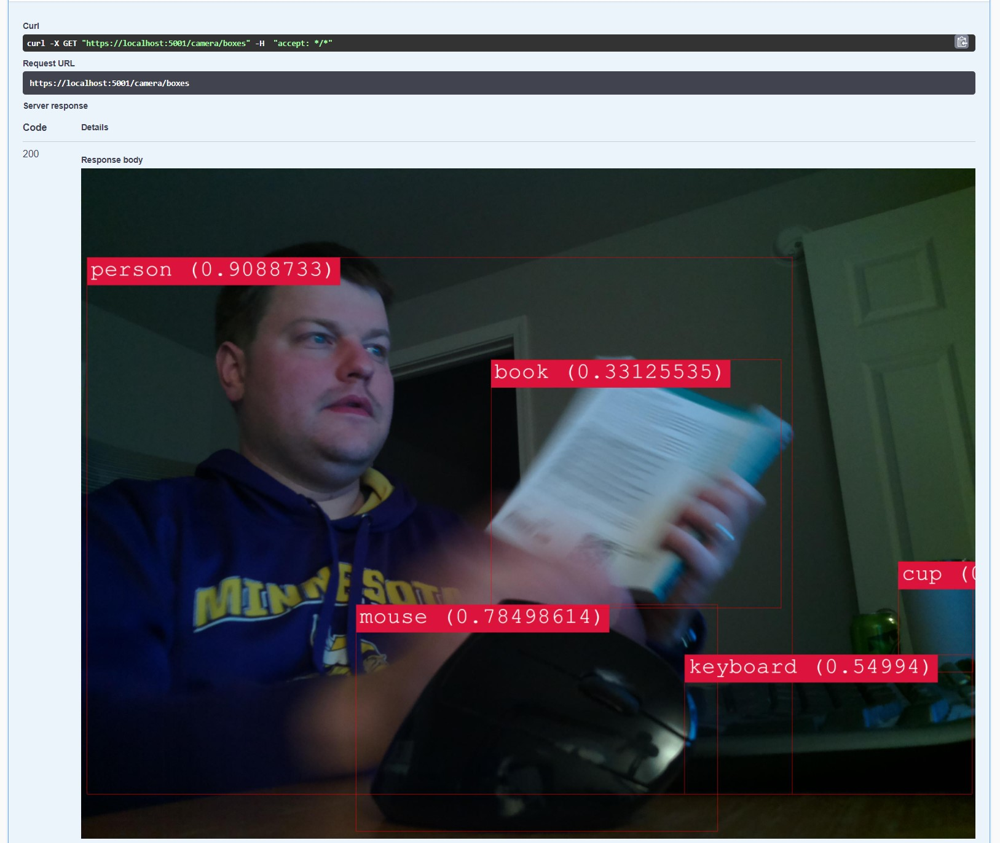

I've always found machine learning interesting, but never taken the time to implement something.
The best way to do that?
Involve my Raspberry Pi of course.
I created an application to detect objects in images captured by my Raspberry Pi.

The application is an ASP.Net Core WebApi which hosts two services.
The first draws boxes around objects in the image returning the modified image.
The second returns a JSON representation of the objects that were found.

Here's a picture of me at my desk with objects labeled via the service:



# ML.Net

I'm using the [ML.Net project](https://dotnet.microsoft.com/apps/machinelearning-ai/ml-dotnet) with a prebuilt machine learning model distributed via the onnx format.
The object detection uses a pre-trained [Yolov4 object detection model you can read more about here.](https://github.com/onnx/models/tree/master/vision/object_detection_segmentation/yolov4)

ML.Net is very interesting as it can be used in various contexts for training and using various machine learning models.
Object detection was my obvious choice here.
However, it can be used for things like sentiment analysis, anomaly detection, image classification, and a whole host of others.

# Using the Yolo v4 Model

Using the Yolo v4 pre-trained model is akin to calling a pre-packaged library, but with a lot of pomp and circumstance around it.
The process involves the following:

1. Collect the image.
2. Preprocess the image for the model.
3. Run the model over the image.
4. Post process the model output for the results.

## Collecting The Image

The image is collected from the Raspberry Pi camera service I built.
The application makes a simple request via an HttpClient to the camera service to obtain the latest image captured via the Pi.

```csharp
var client = new HttpClient();
var image = await client.GetByteArrayAsync(_options.Value.ImageSourceUrl);
```

Which gets converted to a Bitmap and wrapped in an InputImage

```csharp
new InputImage(new Bitmap(Image.FromStream(new MemoryStream(imageData))))
```

The InputImage is used as the input to the ML.Net model later.

```csharp
public class InputImage
{
    public InputImage(Bitmap image)
    {
        Image = image;
    }

    [ColumnName("bitmap")]
    [ImageType(416, 416)]
    public Bitmap Image { get; }

    [ColumnName("width")] public float ImageWidth => Image.Width;

    [ColumnName("height")] public float ImageHeight => Image.Height;
}
```

## Preprocess the Image / Build the Pipeline

The image is in a format the model can't process originally.
It needs to be reduced in size to 416x416 pixels and the pixel format needs to be formatted to floats.
This is done via the ML.Net context transforms which has a few preprocessing steps before feeding it to the onnx model.

```csharp
var outputColumnNames = new[]
{
    "Identity:0",
    "Identity_1:0",
    "Identity_2:0",
};
var shapeDictionary = new Dictionary<string, int[]>()
{
    {"input_1:0", new[] {1, 416, 416, 3}},
    {"Identity:0", new[] {1, 52, 52, 3, 85}},
    {"Identity_1:0", new[] {1, 26, 26, 3, 85}},
    {"Identity_2:0", new[] {1, 13, 13, 3, 85}},
};
var inputColumns = new[]
{
    "input_1:0"
};

var mlContext = new MLContext();

var pipeline = mlContext.Transforms.ResizeImages(
        inputColumnName: "bitmap",
        outputColumnName: "input_1:0",
        imageWidth: 416,
        imageHeight: 416,
        resizing: ImageResizingEstimator.ResizingKind.IsoPad)
    .Append(mlContext.Transforms.ExtractPixels(
        outputColumnName: "input_1:0",
        scaleImage: 1f / 255f,
        interleavePixelColors: true))
    .Append(mlContext.Transforms.ApplyOnnxModel(outputColumnNames, inputColumns, _yoloModelPath, shapeDictionary));

var model = pipeline.Fit(mlContext.Data.LoadFromEnumerable(new List<InputImage>()));
var predictionEngine = mlContext.Model.CreatePredictionEngine<InputImage, YoloOutput>(model);
```

## Run the Model Over the Image

The model then needs to run over the preprocessed image.
The model has a very specific format for both it's input and output.
I previously mentioned the input data, but it returns three separate outputs with the resulting data.

```csharp
predictionEngine.Predict(new InputImage(new Bitmap(Image.FromStream(new MemoryStream(imageData)))));
```

## Post Process the Model Output for Matches

This is an algorithm specific to the model that takes the output data and formats it into useful output.
The model defines this in Python, and other smart folks have ported it to .NET which I wrapped in a C# class.
I'm not going to include this.  Check out `YoloPostProcessor.cs` in the GitHub repository.

The end result is an IEnumerable of these:

```csharp
public record ObjectDetectionResult(float Left, float Top,  float Right, float Bottom, string Label, float Confidence)
{
    public float Width => Right - Left;
    public float Height => Bottom - Top;

}
```

That contains the location of the object found in the image, the type of object found, and the confidence of the model for the object detected.


# Wrapping Up

Overall, I was surprised at the things the model could detect.
It's really fun to take random pictures and to see what it finds.

However, running the model with ML.Net was difficult to piece together at first.
I had to rely heavily on other projects other folks had built in order to figure out how to piece it all together.

The results were definitely worth the effort.

[See all the code on GitHub](https://github.com/jerhon/hs-object-dectection-service).
