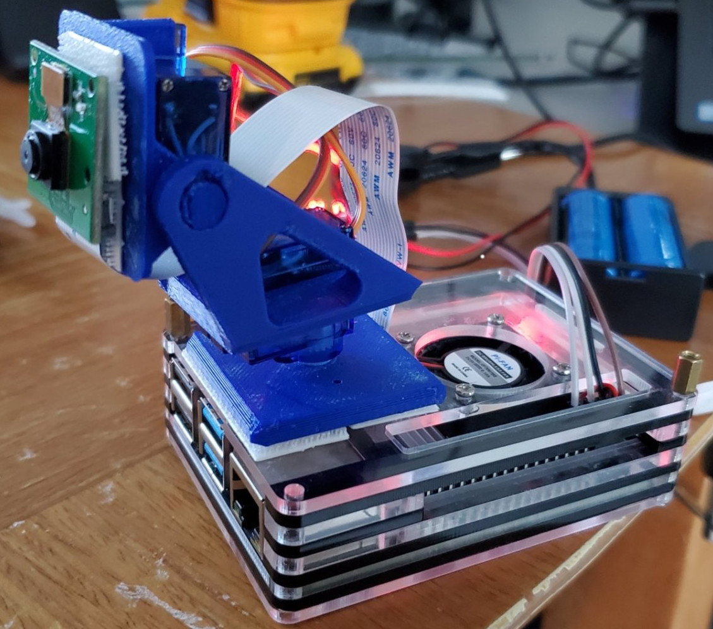

In a previous post I introduced my project to take pictures with my Raspberry Pi.

So far, this is a two part project.
1. Build an image microservice I can use to snap pictures of the outside world.
2. Build a machine learning microservice which has the capabilities to recognize objects in those pictures.

For the next part of my project, I wanted to mount my camera on my Raspberry Pi.
Rather than having it be in a fixed positon, I wanted it to move.
So, I decided to build a pan/tilt arm.
The pan tilt arm allows the camera to Pan 180 degress, and tilt 120 degrees.
Here's a picture of what my Raspberry Pi currently looks like.



## The Pan / Tilt Assembly

I used my 3D printer to print out the assembly for the Pan / Tilt arm [from a model on thingiverse.](https://www.thingiverse.com/thing:4710301)
After printing the model, it became apparent rather quickly the original did not have room for the wires to fit through the servos.
I modified the base slightly to add a small rectangular gap for the wires.

I printed it at a low resolution.
The print otherwise came out well though, the arm takes two servos without any complex gear mechanisms, and the servos fit very snug.
I used some interlocking command strips to put the arm and camera into place.
I wanted to be able to easily disassemble it as I was debugging.

## The Servos and Raspberry Pi Interface

While it's possible to run the servos directly off the Raspberry Pi board, I decided to use a dedicated PWM (Pulse Width Modulation) board to control the servo movements.
Running it directly off the Pi would have all needed to be controlled through software and susceptible to issues if the CPU were to get overloaded.
Since I eventually want the Raspberry Pi to run the machine learning models for object detection, I was concerned the servos wouldn't hold position if the Pi becomes under high load.

The board [I picked was a PCA9685.](https://www.amazon.com/gp/product/B07WS5XY63)
It provides 16 PWM outputs to control up to 16 servos.
The board communicates over an I2C bus, so I would only need four wires: two for the power and two for communication back to the Pi.
The boards can also be chained together and have a system to allow for separate addressing for up to 6 boards by soldering two points together on the PCB.
That would mean I could technically use up to 96 servos.

## Communicating with the PCA 9685

This was my first time using an I2C bus.
It was interesting, and I really appreciate how versitile it is.
For my purposes, I am able to read and write registers on the PCA 9685 board via I2C.
I reference the device by address, and configure the registers appropriately to initialize the board.
Lastly, I set the appropriate settings to control the PWM output for each output on the board.

For this work, I'm using the [Unosquare Raspberry Pi NuGet package](https://www.nuget.org/packages/Unosquare.Raspberry.IO).
Once set up, it gives me a very clean interface to obtain an object which represents an I2C device and write/read values to the registers.
For example, setting the board to output a waveform with a period of 50Hz looks something like this.

```csharp
public void SetPeriod(int frequency)
{
    double prescale = CLOCK_FREQ;
    prescale /= 4096; 
    prescale /= frequency;
    prescale -= 0.5;
    prescale = Math.Floor(prescale);
    var oldmode = _i2c.ReadAddressByte(MODE1_ADDR);
    var newmode = (byte)((oldmode & ~MODE1_RESTART) | MODE1_SLEEP);
    _i2c.WriteAddressByte(MODE1_ADDR, newmode); // Sleep
    _i2c.WriteAddressByte(PRESCALE_ADDR, (byte)prescale); // prescale
    _i2c.WriteAddressByte(MODE1_ADDR, oldmode); // wake
    
    Thread.Sleep(5);
    _i2c.WriteAddressByte(MODE1_ADDR, (byte)(oldmode | MODE1_RESTART ));
}
```

The prescale is a value specific to the board.
It scales the 25MHz speed of the board down to the 50Hz(frequency parameter) output required by the servos over a 4096 value range.
The timing of the pulse in that 50Hz cycle is then set based on values within a 4096 range.
The specification on the board outlines all this, and there are plenty of libraries written in non dot net languages that can be used as reference as well.
I'm not going to go through all the code here, you can see it in my [GitHub repository for the project](https://github.com/jerhon/hs-pi-camera-service).

## Using the Servos

It takes two servos to control the arm.
[Here are the servos I'm using.](https://www.amazon.com/gp/product/B07L2SF3R4)

In my program I had set up one class for each device.
So one class for the PWM board, and another class for the servos.
Rather than each Servo being an individual object, I decided just to make a servo class which controls all the servos on a particular PWM board.
Since the work to interface to the PCA was done, I just had to code the parameters around the servo for the PCA board.

The servos contained specs which indicated they need to run at 50Hz with a minimum/maximum pulse duration.
I had to tweak those values a bit.
I eventually came up with it running was at 50Hz with a pulse 0.0005 to 0.0025 seconds.
I don't have an oscilloscope, so it was a bit of trying values and increasing the range until I a result with the full range of servo motion.

That value is scaled into a user range.
I had set up my servo so that I can get approximately 180 degrees of rotation from it.  
I set the user range for the Servo object to 0 to 180 with 90 being center.

The resulting call to the Pca9685 class then looked something like this:

```
var value = userValue * (_maxPulseWidth - _minPulseWidth) / (_maxUserRange - _minUserRange) + _minPulseWidth;
_pca.ConfigurePulse(idx, value);
```

## Interfacing the Servos

The final piece was interfacing the servos.
Since I'm using a .NET project, I have created an API that I can use to `POST` a new postion to the servos.
Straight forward stuff.
I'm injecting the servo into my API controller through constructor injection, and I have a few options that control the angle.
It also controls the parameters so that values can't exceed the expected degree of motion by the servo.

```csharp
[ApiController]
[Route("position")]
public class PositionController : ControllerBase
{
    private Servo _servo;
    private IOptions<ServoOptions> _options;
    
    public PositionController(Servo servo, IOptions<ServoOptions> options)
    {
        _servo = servo;
        _options = options;
    }
    
    // ...
    [HttpPost]
    public void Position([FromBody] PositionDto position)
    {
      var panAngle = GetValidAngle(position.PanAngle, _options.Value.PanMin, _options.Value.PanMax);
      var tiltAngle = GetValidAngle(position.TiltAngle, _options.Value.TiltMin, _options.Value.TiltMax);
      
      _servo.SetAngle(0, tiltAngle);
      _servo.SetAngle(1, panAngle);
    }
    
    // ...
}
```


##  Links

Here's links to everything from the project:

* [Pan/Tilt Arm 3D Print](https://www.thingiverse.com/thing:4710301)
  * You can find different arms on amazon as well.
* [These are the PCA9685 boards I'm using](https://www.amazon.com/gp/product/B07WS5XY63)
* [These are the servos I'm using](https://www.amazon.com/gp/product/B07L2SF3R4)

When buy cheap electronics, it's good to buy a few of them at a time in a bundle.
Depending on quality control of the supplier, it's easy to get a dud from time to time.

Here is my [GitHub repo](https://github.com/jerhon/hs-pi-camera-service) with the code.

## Wrapping Up

Keeping with an Agile mindset, it's been fun incrementally adding functionality to this project and having a small goal and achieving it.
While I could have bought and used an out-of-the-box solution written in a different language like Python, or Node, a lot of the fun for me is learning how to piece things together and how they work as part of that journey.
