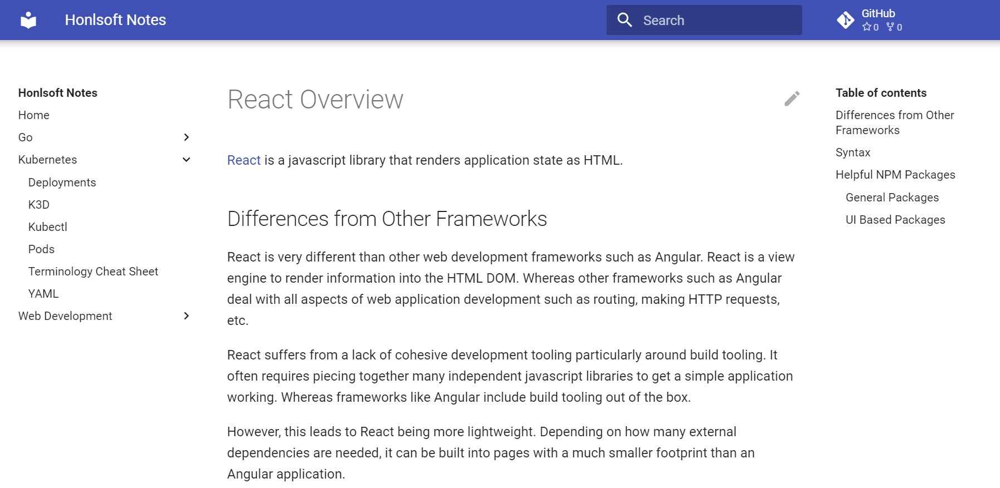
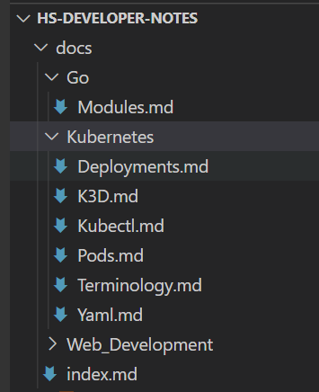

Many software projects enlist the amount of complexity that requires documentation.
The primary reason for the documentation to either aid external users on how to use the project, or to document the internal complexities of the software for other developers.
While commenting code and public interfaces can help, it's sometimes helpful to include extra details about how an application is built for other maintainers.

There are many tools to write documentation, keeping the application and the documentation together in sync often be a challenge.
Additionally, based on the tools being used, the discoverability of documentation can also be difficult.
Sharepoint sites are notoriously bad and end up becoming a graveyard of documents from years past.

One solution that's been employed by the open source community is to use the same software development tools to keep and version the documentation.
This means- keeping the documentation in GIT alongside the project.
Naturally, if I can find the code, I can then also find the documentation.
Typically, this is done through Markdown or a similar Markdown language such as AsciiDoc.

However, just keeping documents in source control isn't a solution for everyone involved in software development.
Business minded team members may not be familiar with the tools developers use.
Also, reading text from plain text files works but does not lend to niceties such as document navigation.

In this case, a simple solution is to run a documentation site generator over the documentation to generate a web page which can be easier to read and use.
In this post, I will be discussing how to build a simple documentation site using a tool named [MkDocs](https://www.mkdocs.org/) themed with [Material for MkDocs](https://squidfunk.github.io/mkdocs-material/).

Here's a screenshot of the output of the generation:



Don't misconstrue this.
I would take working software with little documentation rather than a well documented architected mess any day.

## Creating the Documentation

A few years ago I had started some markdown documentation for various technical topics.
I decided to restart that effort, but start from scratch.

First off the tool has some assumptions for basic use.
All documentation is kept under a 'docs' folder in the source repository.
It's possible to use a different directory based on command line options, but I believe this is a great way to segregate the docs from the source and make them easy to find.
In a normal project, having a separate folder for documentation makes a lot of sense.

Each page needs to be written in markdown.
If you don't have much experience with markdown, it's a way to mark up text documents to delineate sections and features in the text such as headings.
For example, this blog post has been written in markdown, and been rendered into html by a plugin in Gatsby.js

Overall, articles just need to be kept underneath the docs folder, sub-folders can be added with additional documentation.



The other key piece is setting up the configuration yaml for MkDocs

```yaml
site_name: Honlsoft Notes
repo_url: https://github.com/jerhon/honlsoft-notes
site_author: Jeremy Honl
theme:
  name: material
  palette:
    primary: indigo
  features:
  - navigation.top
  - navigation.instant
```

There are a ton of options for the theme documented [on its website](https://squidfunk.github.io/mkdocs-material/setup/changing-the-colors/).

## Previewing Changes

I personally like to run the tooling in Docker.
This avoids having to install swath of dependencies related to Python on my machine.
This is the commandline I use in powershell, a simple one-liner.
I just have a powershell script I run that keeps this.

```docker run -it --rm -v $PWD`:/docs -p 8000:8000 squidfunk/mkdocs-material```

Once it starts up I can navigate to http://localhost:8000 and see the site.
A great feature this supports is hot reloading.
The moment I change something in my markdown and save, the site will refresh immediately and show the change.
All around it's a great experience.

## Building

Building is also simple.
Again, I like to use Docker to build the site to avoid extra dependencies.
I setup a powershell script to run this command as well.

```
docker run -it --rm -v $PWD`:/docs -p 8000:8000 squidfunk/mkdocs-material
```

## Hosting with Netlify

Netlify requires a few extra files in order for it to be able to build the material-mkdocs site.
First, to indicate the python packages to use, then the version of Python.
The version of Python is very finicky, be sure to check out Netlify's build documentation to see what the latest is.

requirements.txt
```
mkdocs>=1.2.2
mkdocs-material>=7.2.6
```

runtime.txt
```
3.8
```

The build command is `mkdocs build` and the publish directory is `site`.

## Wrapping Up

I hope you found this useful.
MkDocs and the Material for MkDocs theme are an easy way to produce high quality and consumable documentation.
The source code for a full example can be found on [GitHub](https://github.com/jerhon/honlsoft-notes/) and the running site is hosted on [Netlify](https://hs-developer-notes.netlify.app/).
