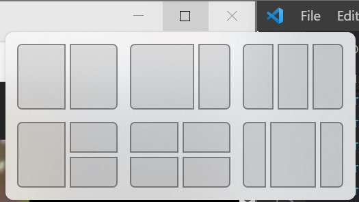
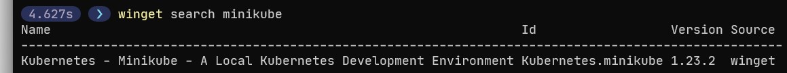
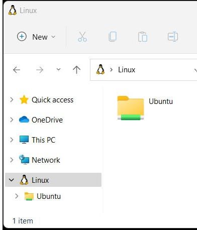
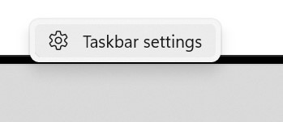
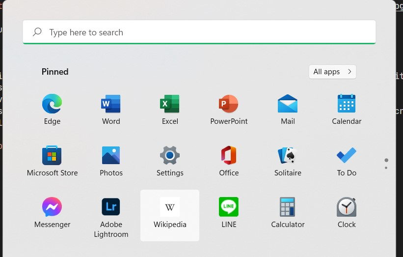

Today I updated to Windows 11 on my laptop.
After an hour or two of use, this is a blog post on some first impressions of things I've noticed.

## Three Things I Like

There are a lot of new things in the OS, these were some initial things I just appreciated as I've been working on Windows 11.

### Maximize Button Shows Layout Options

Hovering over the maximize button now gives you the option to the window in a particular layout.
Snapping a window along the edges of the screen has been a feature of Windows for a while, but this makes the process a little less clunky.

### winget

Winget allows installing applications and packages from the command line.
The store is greatly expanding as Microsoft doesn't require an application to be UWP to go in it's store.
There were tools such as chocolatey that did this in the past, but now the OS has an official way to install applications from the command line.
I also like being able to list and audit what I have installed from the command line.
This is going to greatly help system admins and casual system admins deal with software installations.

### Easier Access to WSL Instances

Trying to browse WSL typically involved remembering to prefix things with `\\wsl$`.
It's nice that it's now become a section in File Explorer.
Yes, this screenshot is File Explorer, and the ribbon has been replaced with a much less crowded toolbar.

### It's Free

Ok, I got through my first three, and I just had to add one more!
I've just become so accustom to Windows upgrades being free.
It's almost hard to remember that these upgrades used to cost a lot of money.
It's quite a testament to Microsoft's business model and strategy to offer significant upgrades for free.

## Three Things I Don't Like

Most of the issues I have are related to the new taskbar, and around the new start experience.

### Missing Right Click Options

One of the most common ways I would get to Task Manager was right clicking on the task bar and selecting it.
However, the options have been paired down quite a bit.

I'll just have to get used to using Ctrl-Alt-Delete to access it.

### The Task Bar Icon Size Isn't Configurable

While it looks nice, the taskbar feels like it takes up extra space due to some of it's UI embellishments.
My previous layout was to use tiny icons on the taskbar.
The task bar is useful and looks nice with the extra visual queues and animations, but overall I just want to keep as much real estate on my screen as I can to accomplishing tasks.

### Where Did These Applications Come From?

There are a lot of apps in my start menu that I never installed and don't really wish to have on my PC.
Somehow, they ended up in my pinned applications.
I was hoping it would have been smarter and collected my most used applications.

I don't really see the need for the pinned applications anyway.
If I can already pin applications to the task bar, what's the point of having another pinning area in the "start menu"?

For example, LINE, Adobe Lightroom?

## Three Observations

### Taskbar Has Changed

While just by looking at it, it doesn't seem the taskbar has changed much, but it has.
A lot of old options have been eliminated, and more focus has been put on the tray to the right.
While portions of it seem more polished, it seems like there is functionality and configuration that's missing.

It seems like ever since Windows 8 was released, the task bar and start menu have been continually revamped, and Windows 11 is no exception to that.
I wish the OS could focus more on functionality rather than new coats of paint.

It's not just limited to the task bar either, I feel like I'm finding more and more areas in Windows 11 that have been modernized with a new coat of paint.

### Speed

Overall, I'm impressed with the speed of the desktop.
A lot of the new settings and configuration screens come up rather quickly.

After reading a few articles internet, changes were made to prioritize foreground tasks.
For example, say the CPU is hammered at 90% by various processes and you open up Microsoft Word.
Windows 11 will re-prioritize Word as being higher priority it's a "foreground process".

I can tell there was obvious focus put into it.
I can really feel the responsiveness as I'm working.

### The Sounds are Different

A lot of the sounds that I've grown custom to over the years for audible alerts on the OS have changed.
Overall, I prefer the new sounds.
Many of them aren't as harsh or pronounced as they were before.
This really will come down to personal preference though.

## Wrapping Up

There are ups and downs to the new OS.
The reworked parts of Windows 11 feels more polished, but at the cost of some reduced functionality.
If they can manage to continue down this path they've started and modernize more portions of the OS with continual updates as Windows 10, I think they have a solid base here.
However, for now, Windows still feels like a hodgepodge of old and new.

With all that said, I like being an early adopter.
I don't regret the upgrade, and there are a lot of new things I'm going to use.
On existing Windows 10 systems that likely won't be upgraded for years, I will miss some of these new features.

If you like your PC / Laptop the way it is, take you're time, and do research.
Windows 10 will be supported for quite some time, and it may be a while before Windows 11 is made available through  Windows Update to more systems.
Even if you do want to upgrade, many systems will no longer be supported due to the more stringent system requirements.