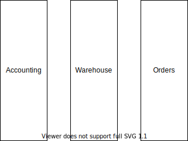

This is the second article in my software architecture series.
I'm going to be delving into monolithic software architectures.
I will not hit all topics, but again this is just to organize my thoughts after recently reading several books related to software architecture over the past year.

## What's a Monolithic Architecture

A monolithic architecture is a piece of software built together and deployed as a single code base.
Internal components of the architecture typically have fewer boundaries and run together in a process.
Sometimes the monolith will have several processes, but the key is that they all share the same code base and are built and deployed together.

## Organizing the Monolith

As a monolith is one big piece of software, the key decision in building to avoiding it from becoming unmanageable is structuring the internals of the software.
To do this, a monolith is divided into layers and components.

The terms component and layer contextually can mean different things.
In the context of this discussion, I am referring component typically is a package or library depending on the technology of choice.
This may be akin to an assembly in .NET or a JAR in Java.
The layers are a conceptual boundary typically used to define what components can interact with each other and to narrow down the purpose of components within the layer.

There are many approaches to internally layering and breaking down software, but these are a few examples.

### The n-tier Architecture

In an n-tier architecture the application has a set of layers based on technology or area of responsibility.
A common approach is to have three layers:

1. The Presentation Layer - Where all the UI logic is.
2. The Business Layer - Where all the business logic sits
3. The Persistence Layer - Where entities for the business logic are persisted.

This works well in situations where groups are divided by technology.
Perhaps there is a group that builds the database logic, and another group that is responsible for building the presentation layer of the application.
Another example would be a dedicated team of web developers.
It becomes simple to know where a change to the interaction with the database should go, vs. where does code for the UI go.

This isn't to be confused with patterns around application development such as MVC (Model View Controller) or MVVM (Model View View-Model) or MVU (Model View Update)?
While there are similarities, those are both design patterns used to build the presentation layer of the software.
Typically, the model portion of those refer to the dependency on the MV or VVM portion to the business layer.

This n-tier architecture is a common pattern, and usually one of the first to be considered when building an application. 

### Domain Driven Design

A domain driven approach divides the internals of application based on business functions.
For example, having a layer that deals with Accounting, another that deals with Warehousing, or another that deals with Ordering.

This can be thought of as a set of boxes. 
The n-tier is a set of boxes stacked on top of each other, all dependent on the layer below.
Domain driven architecture is a set of vertical boxes where technical considerations are hidden inside the layer.
Interactions between domains have a more rigid formalized interface as they escape their software layer.

Or stated another way, n-tier architecture views technology as a cross-cutting concern.  Domain driven architecture views the business domain as the central piece of the application.
A particular domain can be implemented as a mini n-tier architecture, but the main idea is that the domain and it's decisions around persistence and business logic are isolated from other business domains in the application.

Domain driven architecture is not limited to the monolithic application, however when it is in a monolithic architecture there are certain constraints over it that are imposed.

It may be that all the domains reside in the same database, or share a similar method of data access.
Perhaps they have their business logic structured differently.
The different domains may need to stay current on the same external dependencies since they will run in the same process space.

### Clean Architecture

Clean architecture is a newer architectural pattern similar to the Hexagonal or Ports and Adapters Architecture, but it is much to large a topic for this post.
The main point is it's there, and there are a number of other architectures that can be considered for a monolithic application.

I plan on doing an entire post on clean architecture sometime in the future.

### The Combination Architecture

Sometimes a monolith may not be one or the other, it can have elements of several other architectural styles
However, they are two of the major architectures to consider.

Perhaps the application is implemented with a domain driven architecture for everything except the presentation layer.
The presentation layer sits on top of each domain driven layer.
Or, a domain driven architecture is used, but a shared persistence layer underpins it.

The techniques can be matched.
However, the key is that clear guidelines are established for the Monolith to avoid it becoming a jumbled mess of code.

## Evaluating the Monolith

### What are the Benefits of a Monolith

The main pro of a monolith is that it's conceptually simple and easy to make.
All code is in a single place.
For small applications, it makes a lot of sense.

This is also a familiar architecture for many software developers.
I remember it being very heavily being favored and taught while I was in college and early in my development career.

Transactions are simpler.
Unlike other architectures such a microservice architectures or event driven architectures, code is run in the same process and different systems within the monolith can enlist in the same transactions.

Debugging can be easier at times, but also more difficult in other circumstances.
Debugging can be simplified because the code base is all together, there is no need to trace changes across multiple code bases.

### What are the Costs of a Monolith

Monoliths without proper architectural boundaries can quickly become a "big ball of mud".
This is due to the lack of separation in the application itself.
If an application is built as one cohesive piece, the internal barriers between components in the application can quickly break down.
Without a clear structure, the application becomes harder to maintain over time.

The typical example would be in a code review, "Why is this code directly querying the database from the UI layer in the application?"
Another common example, "Why is this business rule in the database?"

Monoliths provide less control for deployments.
As the code bas is entirely built together, it often also needs to be deployed together to maintain consistency of the system.
This means small changes can trigger huge waves of change throughout an application.

For example, a change in accounting business logic would trigger a full build and deployment of the entire application.
This would include deploying things even though they didn't change maybe such as ordering or warehousing logic.
This can lead to new issues in the ordering or warehousing system even though nothing has changed.

Conceptually, the software becomes more difficult to manage as it becomes bigger.
As editing one portion of the software can affect potentially anything and everything else in the monolith, the number of considerations that need to be taken into account when change the software drastically increases.
A bug can introduce rippling effects across the entire system rather than being contained to just one portion of the software.
Layering and building proper components can reduce this.
However, interdependency management and architectural boundary enforcement is often a problem due to the ease of linking together components.

Observability can also become more difficult.
The internals are harder to inspect since there is limited external communication with other entities.
As opposed to a service based architecture where calls between services are easier to instrument.

Since the application is deployed together, it's harder to scale individual pieces of the application.
Say it's the end of the year, and accounting has a lot of processing going on.
It's hard to scale just accounting functions in isolation.
This is especially difficult on the database.
Since a monolith typically resides in one database, it limits the options to scale the persistence for individual pieces of the business. 

As the monolith grows, deployments can become more complicated especially if the monolith grows to have several executables that need to be run in different environments.

Debugging can become more difficult if the code base becomes too large for simple operations.

Monoliths can hamper innovation.
Changing a technology requires retrofitting a very large application rather than smaller pieces of it.
Introducing new technology can cause similar problems.
The new technology needs to be able to integrate with older pieces of the system that may not be able to be re-written immediately.

## Things to Avoid when using a Monolithic Architecture

When the pattern is misapplied, software development can easily go wrong.

### The "Big Ball of Mud"

This is when software breaks down and has no notion of a structure to it.
Or - the code is so difficult to change, a change cannot be made to it without affecting many other parts of the system.
This is especially dangerous in monoliths since the code base is so large. 

"Big Ball of Mud" is a common phrase that comes up frequently when discussing monolithic architecture.

### Just Another Layer

The application gets divided up into too many layers with no discernible reason.
While it's possible to have more than 3 layers in an n-tiered architecture, it needs to be a balance.
Too many layers increases the difficulty of making changes in the software.
Too few layers increases the coupling in code and also makes changes hard.

Layers and components need a specific justification to exist.

### The Ultralith

Usually an application is architected by itself, and boundaries to other systems have a formal interface such as an API or messaging system.
This is when the code base of an enterprise has become intertwined even at the application level.
Many applications have a singular code base and have to be deployed at the same time to work. 

I struggle to find a word to describe this.
Sometimes I call this the Mega-Monolith or Megalith.

The ultralith is when a software teams and application boundaries completely break down.
Many applications that a company owns are in turn taken and built together as a single code base.

An example would be one or more companies mobile application is inexplicably tied to the same code base as it's internal ERP development.

While certain tools for configuring an application may make sense to be in the same code base, I'm referring to applications that are typically viewed as completely different products by the business.
For example, two products shared the same code base just because they are products built by the same company.
There are ways to re-use code without having to build everything together.

This is a very dangerous place as it makes deployments very difficult for an organization.
If many teams and products in an organization are dependent on the same code base, deployments become very difficult.
A change to one application may affect another.
It becomes difficult to test the effects of a change on the software because it's impossible to test all affected areas.
This also makes it hard for individual teams to innovate as they are tied to code base of a much larger organization rather than just their team.

## Wrapping Up

The point of this article was not to say monolithic architecture is good or bad.
It has tradeoffs and monolithic architecture is an approach that should be considered when developing an application.
It needs to fit the application and the business in order for it to be successful.
Taking any pattern or architecture and prescribing it as the cure to all software development's woes will cause tremendous pain in a development organization when the architecture does not fit.

Thanks for taking the time to read my post.
While I could likely write more on this topic, these are just a few of my thoughts as of late.
I just wanted to jot them down as an exercise to advance my knowledge.
