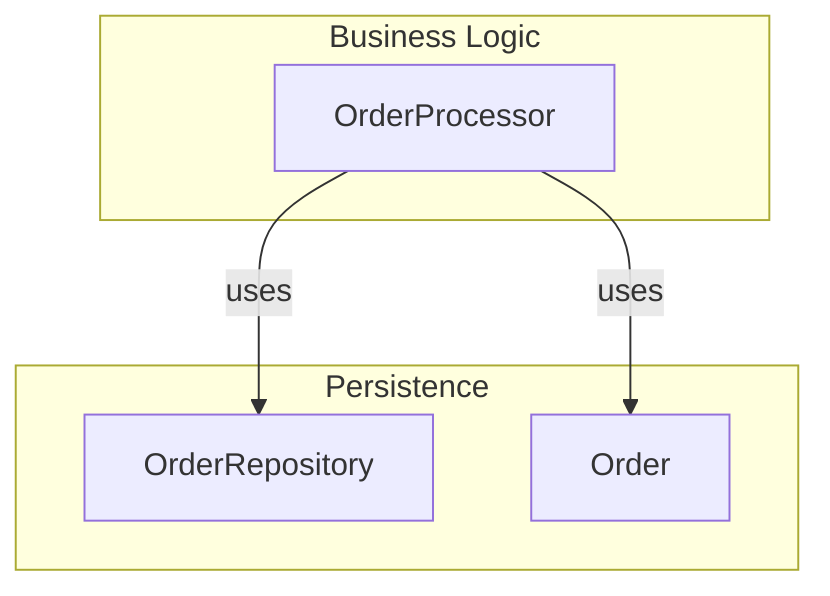
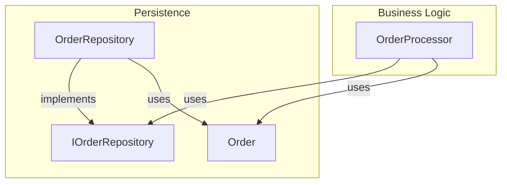
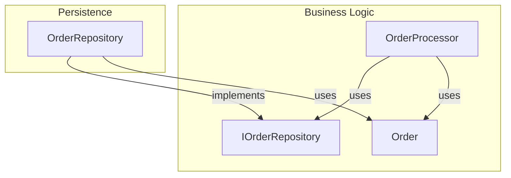
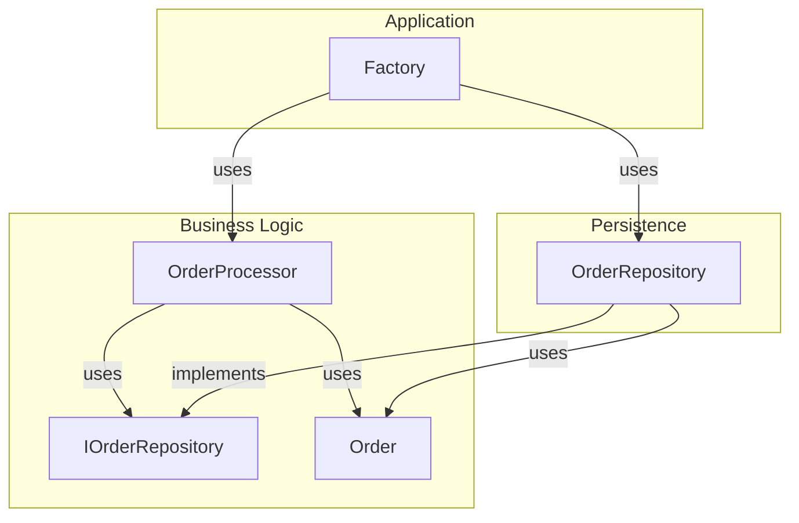

Dependency inversion is a practice to help decouple code from its implementation.
Specifically, it helps to control the flow of dependencies from one component to another.

It's a crucial technique to have in a Software Architect's tool chest as it can help to craft the dependency chain in an application and enforce architectural boundaries.
By being able to control the direction of dependencies in an application we can control where change needs to occur for an application and what layers it affects.

## The Code Sample

For example lets say we have two classes that reside in different components of the system.
One is dealing with data access, and the other is dealing with a business logic process.
* An order processor, which would be business logic for processing an order in a fictitious business.
* An order repository, which will deal with saving the order to some persistent storage.
The order processor is dependent on an order repository because as part of the process the order needs to be persisted.

This is a contrived example, of course there would be a lot more logic to an ordering business process, but the goal here is to show what dependency inversion does.

```csharp
public class OrderProcessor {

    OrderRepository _repository;

    public OrderProcessor(OrderRepository repository) {
        // There would likely be more dependencies here in real world code, but this is just an example.
        this._repository = repository;
    }

    public PlaceOrder(ShoppingCart shoppingCart)
    {
        //... Extra validation and processing before order can be placed ...

        var order = MapOrder(shoppingCart)
        this._repository.Save(order);
    }

    private Order MapOrder(ShoppingCart shoppingCart) {
        // Converts the shopping cart to an order... implementation is not important to the goal of this code example
    }
}
```

## Inverting the Dependency

Many architectures call for separating out the business logic and persistence layers into separate layers or components.
In this case, the business logic is dependent on the underlying persistence storage.
If we use a flow chart to visualize the dependencies, it would look like this.



While this isn't necessarily a bad thing, it puts the persistence layer as the center of the architecture.
If the persistence layer were to need to change for any reason or an alternate version were needed, the OrderProcessor would potentially be impacted as well.
We can mitigate that somewhat by introducing an interface that Order Repository implements.




Now the Order processor is no longer dependent on a specific implementation of the OrderRepository, but in a way it still is.
Since the interface it's using and the objects it's using to convey an order are owned by the persistence component, it's still tied to that specific implementation in the persistence layer.

This is where the real value of dependency inversion comes in to play.
Rather than having the interface be part of the persistence layer, we switch it to be part of the business layer.
The order object will need to come along for the ride as well.



While IOrderRepository and Order have moved, the subtle difference here is that we have completely switched around the dependency between the two software components.
Rather than the business logic being dependent on the persistence layer, the persistence layer is now dependent on the business logic.

If code could talk, the business logic is declaring "I need to store my Order object in a repository.
It is up to the persistence layer to implement it to dice up my Order object and persist it in a way that is appropriate for the underlying storage."

Another way to look at it--the persistence layer now changes because of the business logic, rather than the other way around.

I used a repository pattern here to keep this simple, but if the code were using the appropriate ORM, it could be that very little persistence logic would be required(if any at all) for minor modifications to the business layer such as adding new columns to tables.

## Creating the Dependency Chain

The final piece of the puzzle here is, how do I create the dependency chain?

If you think about the application before the refactoring, it's possible the business logic could have created the concrete OrderRepository.
However, since the dependency has been inverted, this is no longer possible in the refactored code base.

The answer to this is having a third layer above all this managing the object creation.
It's typically the Application layer the entry code for the application that knows all the dependencies in the application and wires them together.



A factory at the application level can create the OrderRepository and the OrderProcessor and inject that specific implementation of the OrderRepository into the OrderProcessor.
In this instance the application is choosing the specific components to hook together.

In practice this means at the top level of the application there is a statement like this.

```csharp
var orderProcessor = new OrderProcessor(new OrderRepository(/* ... extra dependencies here ... */));
```

To make this even more simple, an Inversion of Control Container can be used to specify for the application IOrderRepository always is implemented by OrderRepository and chain the dependency graph together.
However, that's out of scope of this post.
IoC could be an entire blog post by itself.

## Wrapping Up

This is a useful little trick that helps to control dependencies in an application.
While I understood for years the benefits of code depending on abstractions such as interfaces, it wasn't until I was introduced to this concept that I understood the placement of the interface can have over the dependency chain in an application.

Being accustom to n-tier architecture, I just always considered the database as the central piece of the application from which everything layered on top.
However, with these practices, it's much easier to invert the chain of dependencies and make the domain the central piece of the application.

Again, this isn't for every situation, but the practice is very important as it allows developers to be in control of the dependencies of their applications.
This is also a key tenant of Clean Architecture, but I will cover that in a future post.
