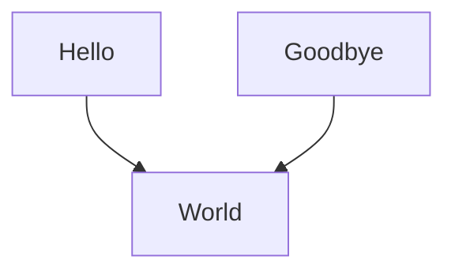
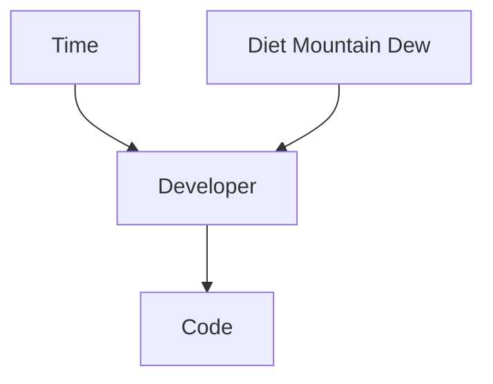

A while ago, I decided to start using Gatsby to build my personal website (this site).
I had been using the static site generator Hugo for a while, but the developer tooling wasn't that great.
As I had been working on React pretty exclusively at work, I figured using React would be a better front end as the developer tooling is much better.
After all React is often rated as one of the top view engines for the web right now.

## What is Gatsby?

[Gatsby](https://www.gatsbyjs.com/) is a static site generator.
Typically, a traditional website works by rendering in real time.
This means when a user accesses a webpage the server goes and assembles all the pieces and information about the website together and renders them.
This typically includes accessing and retrieving data from a database.
Depending on the webpage being built, there can be quite a bit of data retrieval that needs to occur.

This is opposed to a static website.
A static website is one where the content is rendered ahead of time.
This works very well for sites such as blogs, or corporate sites where the content is not user specific.

This doesn't preclude Gatsby from being able to access dynamic data, as it could call APIs to dynamically retrieve data.
However, a majority of the data that goes into the site is known beforehand.

### Rendering Data in Gatsby

The other great thing about Gatsby is its system for ingesting and accessing data.
At build time, Gatsby produces a database of data it ingests to build the site.
This includes assembling things like markdown, perhaps static JSON or YAML files, and it can pull in data from a CMS like WordPress.
It provides a GraphQL interface to query the data.
The GraphQL data is queried at build time, and the output of those queries is also statically stored and available to the site.

The result is building pages and templates in Gatsby which do all that work that's typically done at request time in a traditional server oriented model to it being done at build time.

### Pre-Fetching Data

Gatsby takes static rendered sites a step further by introducing some very smart logic around navigation.
If I'm on a page, and it has a link to another page, Gatsby will pre-fetch the data on the second page.
This means the network traffic to access the page has likely already occurred before even clicking the link.
It makes for a great experience and makes the web sites feel extremely fast.

### Plugins

Gatsby has a very extensive plugin ecosystem.
By modifying the configuration file and adding a few lines, data can be ingested from other sources very easily.

One of the plugins I use for my personal website is a plugin to ingest markdown files and render them as HTML using [remark](https://remark.js.org/).
Remark itself is extensible and allows plugging in extra functionality to modify the markdown rendering process.

## What is Mermaid?

[Mermaid](https://mermaid-js.github.io/mermaid/#/) is a tool to build diagrams from small domain specific languages around the diagrams.
For example, I can translate the following text into a diagram

```
flowchart TD
    Hello --> World
    Goodbye --> World
```

Produces this



Mermaid has a number of different diagrams to use, and it has a rendering engine written completely in javascript which makes it great for embedding in web pages.

This makes it very easy to store diagrams in markdown.

## Having Gatsby / Remark Render Mermaid Diagrams

Typically, to do something like this, I'd just need to check the Gatsby plugin registry and pick one.
There were a few plugins out there, but nothing that I felt comfortable using.
The top plugin was several years old and hadn't been updated in some time.
It was also doing some interesting things where it would render the diagram at build time using `pupeteer`.
The others had very low usage, so I was very cautions about using them.

I decided to just take the plunge and create my own plugin for gatsby-remark.
It ended up being much easier than I expected.

### The Layout of the Plugin


Any local plugins that are built as part of a Gatsby project need to be in a specific folder `plugins` at the root of the site.  This does not include plugins that are installed via npm.  Those sit in the `node_modules` folder.

The structure for a local plugin looks like this.

```
plugins/
    gatsby-remark-mermaid/
        index.js
        gatsby-remark-mermaid.js
```

I needed both the code for the plugin in `index.js` and a package definition in `package.json` for it to work correctly.

### The Plugin Code

The code ended up being extremely simple.

```javascript
var visit = require("unist-util-visit");

module.exports = ({ markdownAST }, pluginOptions) => {
  visit(markdownAST, "code", node => {
    if (node?.lang === "mermaid") {
      node.type = "html";
      node.lang = undefined;
      node.children = undefined;
      node.value = "<div class=\"mermaid\">" + node.value + "</div>";
    }
  })

  return markdownAST
}
```

The plugin is exporting a function.
The function takes two arguments, the first of which being the abstract syntax tree for the rendered markdown, the second being the plugin options.
The plugin options are just opaque gatsby and passed in from the configuration file, which we will see later.

The abstract syntax tree adheres to [mdast](https://github.com/syntax-tree/mdast).
Each node has a `type` property which describes what it is.  IE a heading, a paragraph, a list, code, etc.
The code uses a utility by the same folks that make mdast to visit each node in the tree using a visitor pattern.

The `visit(` call is iterating over each node in the tree.
The second parameter limits down the nodes that are returned to just ones related to code.
When it gets to one it calls the lambda function I passed in `node => `.
That's where the logic for manipulating my markdown happens.

I take those code nodes and if their language is markdown, I just alter the node to be HTML with the value being the text inside the code block.
This is wrapped in a &lt;div class=&quot;mermaid&quot;&gt;&lt;/div&gt; tag to indicate it's a mermaid diagram and to have mermaid library process the div.

It's important to note that this does not pre-render the diagrams at build time.
However, in the future I may decide to pre-render by using the markdown CLI which would render the diagram at build time and not having to rely on the markdown javascript library in my site code.

### Configuring my Plugin

In my `gatsby-config.json` file, I just add my new plugin in the list of my remark plugins.
This actually took some time to figure out.
There were a few different examples on the web of referencing a local plugin that didn't seem to work right.
Just using the plugin name in the resolve, Gatsby was able to resolve it to the local `plugins` folder.

```
{
      resolve: `gatsby-transformer-remark`,
      options: {
        plugins: [
          // .. Other plugins that aren't important for this example...
          {
            resolve: `gatsby-remark-mermaid`
          }
          // .. Other plugins that aren't important for this example ...
        ]
      }
}
```

### Hooking up Mermaid in my Posts Page

Now, I avoided adding a script in my plugin.
I may do that eventually, but for now, I just wanted to  have pages initialize mermaid themselves.

Basically a page opting into the mermaid logic needs a little bootstrapping.
In my React component where I build out the page, I just have it call the mermaid library.
The first effect just being called once on first page initialization.

```javascript
  useLayoutEffect(() => {
    mermaid.initialize({ });
  }, []);
```

The second when post content changes, for mermaid to pick up any new diagrams that React renders to the DOM.

```javascript
  useLayoutEffect(() => {
    mermaid.contentLoaded();
  });
```

The trick is the second parameter in the React hook.
It's used to tell React when to re-run the effect.
If it has no parameters, it will run the effect on every render.
If it has parameters, it will run the effect when the parameters in the array change.
If it's an empty array, it will run the effect only on the first render.
Pretty standard React hook stuff.

## Wrapping Up

That's it!
I was surprised at how little work this was.
Gatsby just keeps proving to me how great it is.

Now I'll keep my diagram definitions in markdown alongside my posts.
Expect me to add more diagrams in future posts.
I'll probably go overboard with diagrams.

Interesting and thought-provoking stuff like this...


