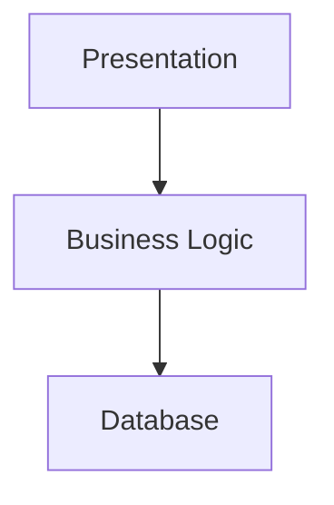
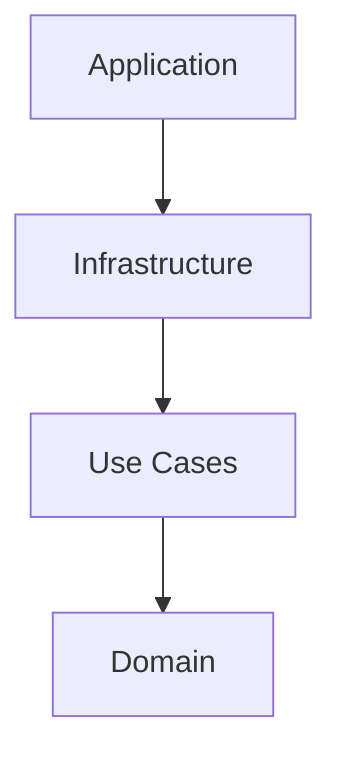
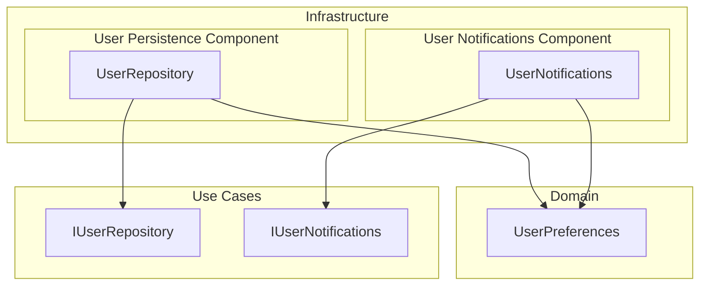
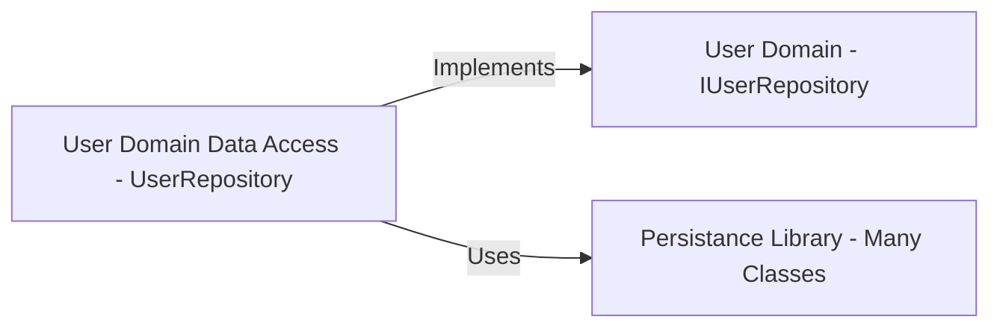

Clean Architecture is a pattern set out by Robert Martin, also known as "Uncle Bob" in the software industry.
It can read about in his book [Clean Architecture: A Craftsman's Guide to Software Structure and Design](https://www.amazon.com/Clean-Architecture-Craftsmans-Software-Structure/dp/0134494164).
This is a post to summarize my thoughts after reading the book last year.

It is an architectural pattern used to structure software.
It's based on the premise that Use Cases and the Business Domain are central to the software.
In other words, I can use an database client library, but it should not be central to the software I'm building.

## n-Tier Architecture

Many applications use an N-Tier architecture where the database sits at the center of the application's layers.
This is not clean architecture, but I'm talking about it as a reference point.

In an n-tier architecture, a database underpins the architecture and used to store data related to the application.
Business logic builds off this and implements business specific rules on top of the database.
The Presentation layer sits as the top layer and controls the user interface, APIs, or whatever external interface the software has.

Here's a diagram where each box represents a layer of the application:



While it works for simple applications, it has some downfalls.

If the database needs to change, it potentially affects all layers above it as they dependent on it.
This means the business logic ends up being coupled to the database.

This is a bit of funny business.
I've rarely had someone on a business team request that I make changes to a database.
Instead, it's I want a form to collect a user's information, be able to view it after it's entered, edit it, etc.

Don't get me wrong, I'm not saying throw out the database.
Applications need databases for state management.
However, making it a central tenant of an application seems silly when it's usually not a central concern of the business.
They'll likely want us to use a database, but how things are implemented in a database is a technical detail and not central to the business case.

In the case of simple form entry, it can make sense to have the database as the central piece of the application.
As most of the work will be revolved around storing data.
However, what if this application also wants e-mail notifications when a user's completed the information?

How about if it needs to notify another application that the user has completed the information?
Things like that don't fit as nicely into this architecture.
Is that business logic?
Partially, it is after all the business is asking for it.
Is that part of "Persistence"?
Maybe it is?
The pieces interacting with the library to actually doing the communication with the infrastructure, probably not.

The business logic ends up getting intermingled with other outlying concerns as there is no clear place to put it.

## The Clean Architecture

Clean architecture is different in that it puts domain logic and customer use cases at the center of the application.
This relies very much on dependency inversion for it to work.
Please take a look at my previous blog post on [Dependency Inversion](./2022-02-11-software-architecture-dependency-inversion)

Here's a diagram where each box represents a layer of the architecture.
The names I use for the layers may deviate slightly from the book.



## The Domain Layer

At the domain layer, we have a set of business objects that represent the problem domain.
Let's say this system is meant to deal with user accounts.
There may be a class UserPreferences that represents the preferences of the user in the system.

Typically this layer is pretty clean, but a lot of care needs to be taken to ensure that they are core domain classes.
It's easy for other layers such as the use cases to creep into this.
For example, if I am working with UserPreferences, what are the things that can be done to user preferences.
Other concerns such as saving the preferences to the database, or sending an e-mail have no business being here.
Those are things that should be done when we go through the process of updating user preferences, but they aren't core to the user preferences themselves.

## The Use Case Layer

On top of the domain layer we have a use case layer.
Each use case gets a class, and the class has a method that carries out the business logic of the use case.

Perhaps the use case is simply that a user can update their preferences.

```csharp
public interface IUserRepository
{
    void UpdateUserPreferences(UserPreferences userPreferences);
}

public interface IUserNotifications
{
    void NotifyOfUserPreferencesUpdate(UserPreferences userPreferences);
}

public class UpdateUserPreferences
{
    private readonly IUserRepository _userRepository;
    private readonly IUserNotifications _userNotifications;

    public UpdateUserPreferences(IUserRepository userRepository, IUserNotifications userNotifications)
    {
        _userRepository = userRepository;
        _userNotifications = userNotifications;
    }

    public void Execute(UserPreferences userPreferences)
    {
        _userRepository.UpdateUserPreferences(userPreferences);
        _userNotifications.NotifyOfUserPreferencesUpdate(userPreferences);
    }
}
```

What I've done is implemented the core use case in code.
I can look at that code and understand exactly what the business was asking me to do.
I want to update the users preferences and send a notification.
This is obviously oversimplified - there would be more logic in here, such as validation of the domain objects, but the idea here is to lay out the pattern and not everything that goes into a use case.

There may be some more technical details to think through here as well.
Questions like: If I'm using two systems, how do I ensure that after I update the user preferences that I get the notification to always be sent when they are updated?
That's a technical issue at this point.
It can that can be remedied with a Outbox pattern, or if the business process is asynchronous and repeatable on error.
I'm not going to go into that here, it could be a whole post by itself.

## The Infrastructure Layer

The Infrastructure Layer is where implementations for things like the database and user notifications sit.

Going back to the n-tier architecture, this would have one or the other be the odd man out.
In the persistence layer if I had the database be central, it may know nothing about notifications.
The notifications would have to have knowledge of the database to use it's entities and depended on it.
Or, if it's a closed layer, there would have to be yet another representation of a UserPreferences in the Notification System and the business logic would have to sort out the two representations.
It's complicated.

In clean architecture, it becomes much more simple.
The infrastructure layer implements the interfaces the use cases need to do their work.

Here's a set of classes in their application layer or component.
Arrows point towards dependencies.



I already detailed the use case layer which left us two interfaces to implement required for the use case.
Components to implement those interfaces live in this layer.
In this instance I would be implementing the persistence store and the notification service for the user domain.
It's possible these could be in the same component, the component boundaries will form around the decisions of what technologies the components and class implementations depend on.

Notice the direction of the dependencies.
The UpdateUserPreferences use case does not change because of the database nor the notification system.
Instead, the database and notification system change when the business logic changes.
If a change needs to occur to the database or notification system, for example, notification system X is obsolete and we need to implement notification system Y, only the "Notification Library" would need to change.
The same goes for the database.

I could implement completely separate versions of the IUserRepository and IUserNotifications interfaces and provide them to the UpdateUserPreferences use case.
Maybe instead of the preferences being stored in a database right away, the saving process sends them to a queue to process asynchronously instead.
It's up to the persistence mechanism to decide the details.

That's really the key to all this.
Clean architecture decouples business logic from it's infrastructure.

This can also makes the code a lot easier to understand.
In applications where there is no database, it is clear where the business entities should go and where they should be modeled.

### The Infrastructure is a Series of Adapter Patterns

One key point is that the infrastructure layer ends up relying highly on the Adapter pattern.
Components in the infrastructure layer typically have some external system they are dependent on.
Things like a database, file access, or a notification system.
This will naturally be a dependency of these components.

So, much of the code in the infrastructure layer can be thought of as an adapter.
It's implementing the interfaces defined by the business domain using the specific database, file access, or notification system.  I did not show those in my diagrams above, but the typical adapter pattern looks something like this.



In this way the infrastructure components depend on the use cases / domain types and they depend on something such as a persistence library.
I'm able to keep dependencies on technology out of our domain and use technology libraries without it becoming central to the business logic.

Another way to look at it, if the persistence library changes, that doesn't change the domain logic, it changes the infrastructure, and the domain logic should behave the same.

## Application Layer

The application layer is really the starting point of the application.
Usually it's the top most dependency in the application the one that actually builds the executable.
It knows about all layers underneath it and thus can generate the dependency graph for the application.
This is where the use case would get wired up to specific implementations it needs to complete it's work.
If this were an API, the application layer may contain the MVC logic to call the use case and translate it's response to DTOs.
If it's a UI, the application layer may contain the MVVM logic to consume the underlying domain model.

## Cross Cutting Concerns

Now there are a few things that may needed to make it up to the domain logic.
Typically these are primitives such as collection types, perhaps implementation of a mediator will be needed for use cases to decouple execution of the use cases from their concrete types.
Those types of things are out of scope of this discussion.

Software patterns that will help organize and keep code well organized.
Sometimes those are OK to keep in the central layers of the architecture.
However, dependencies implementing specific technologies such as databases, file access, or notifications systems are not.

For example, I would probably reference the MeditR library at the use case layer of my application.
It is a very good implementation of the Mediator pattern in .NET.
This way each use case can be implemented as a request in the mediator pattern, and I no longer have to worry about the details of constructing and calling the use cases.
It provides a singular point of entry to access the use cases.

## The Benefits and Costs

Like every architecture there are benefits to using it, and also costs.
There is no one size fits all architecture.

This architecture decouples business logic from its underlying infrastructure.

It fits very nicely with other patterns such as CQRS (command-query responsibility separation).

For simple implementations, there are libraries such as EF Core which can directly take some business entities and represent them as a database structure.

It provides a very simple way to understand where various logic should sit in an application.

Initially the architecture can become complex to describe, especially if control over where interfaces need to be placed in the application layers.

Separating services in the application layer for different components can be difficult at times.
For example, what methods go into the IUserRepository interface vs the IUserNotification interfaces?
What about when we are using an Outbox pattern and the notifications themselves are saved in the database temporarily before being sent?  It's harder to keep the Single Responsibility Principle in mind for abstract interfaces, especially in .NET.  This is much easier in other languages that support duck typing such as Go.

There are a lot of layers in this application, and they all have a very specific purpose.
As with all architectures, it's possible to add additional layers or remove some layers as needed.
The main point in clean architecture is that all layers point inward towards the use cases and domain.
The domain itself never relies on the outside infrastructure.

## Wrapping Up

This blog post is a simplified example of what a clean architecture would look like.
However, I hope it was enough to help understand the benefits of it.

Clean architecture is one of my favorite things I've learned about in the past year when it comes to pure coding.
Even when I'm not using it, it shifts how I think about implementing code, abstractions, and adapters- where dependencies sit, etc.
Even how I go about translating business logic into code such as having a representation of the use cases as a first class citizen of the code.

Even with that glowing review, my point isn't to say every application should use a clean architecture.
While I think it's a very good architecture and should be considered when building new applications, saying all applications should be built using Clean Architecture would be very bad.
An architecture needs to fit the application and the business to be appropriate.

I hope you enjoyed this post.
Again this is just a way to organize my thoughts and commit them to memory after reading Clean Architecture.