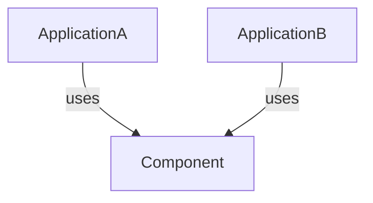
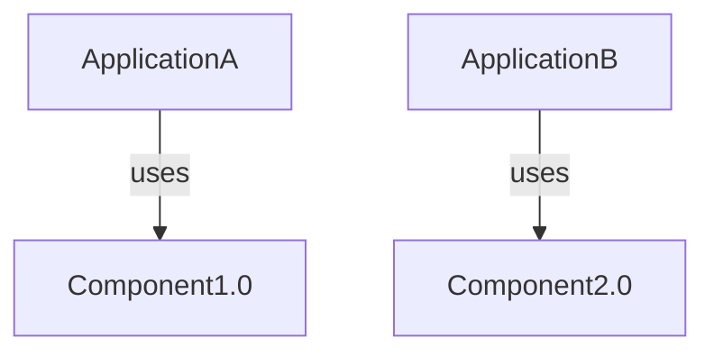

For most of my posts in my software architecture series, I've been talking about defining boundaries and layering software to build a piece of software.
In this post, I want to talk about dividing layers up even further into software components.

## What's a Software Component

A software component is a set of code that is typically built and deployed together and cannot be broken apart from that deployment unit.
In .NET this would be an assembly.
In java this would be a jar.
In interpreted languages the lines get fuzzier when there are not clear outputs, in Python I would say this is a  module, but could argue it's a Python package.
Regardless of the mechanism, a software component is a way to bundle a set of code together into a cohesive unit that can't be broken apart.

Components is an ambiguous term, and could mean other things at different levels of a software system.
In this instance, I am referring to dividing up the internal structure of a piece of software.
This shouldn't be conflated with things like a system component which would be a piece of software like an application that is part of a larger system.

## When to Create Software Components

It's really easy to create a software component in most modern languages.
Usually, I find myself reaching for components in a few situations.
Both revolve around re-use, but typically internal re-use vs external re-use.

### Internal Reuse: Organizing Code and Creating Boundaries

Using software components internally in an application can help promote organization and determine where changes should occur.

For example, I may have an accounting application, if I keep all my accounting domain logic together, I can create a single component containing the domain logic.
I should never reuse that component anywhere else other than within that application as it is application logic, but following good component principles outlined later in this post make my system easier to change.
I have a single place where my domain logic resides and where I need to change it.

This is the most common way I use software components.

### External Reuse: Reusing Software Components Across Applications

When I have an application and I need to use the same code across multiple applications, creating a software component and packaging it via a package manager makes sense.
However, when the component can be released independently, other concerns come into play such as versioning, package repositories, and so on.

This enables me to have two separate applications that want to rely on the same code, but keep their application logic separate of each other.

With open source, this has become just a daily reality for most software developers.
It seems like there is an open source library to perform most tasks.
We really are living in an age of software reuse.

## Principles of Software Components

In [Clean Architecture: A Craftsman's Guide to Software Structure and Design](https://www.amazon.com/Clean-Architecture-Craftsmans-Software-Structure/dp/0134494164), Robert Martin highlights three different principles for components.
I think these were a great set of principles to use as a guide in building good software components.

### The Reuse/Release Equivalence Principle

> The granule of reuse is the granule of release.

In short, for a software component to be reused, it needs to be released.
The term "release" may conjure up all kinds of images of large meetings with various levels of a software organization involved, and project management.
That's not what I'm talking about here.

In order to reuse a software component, it needs a mechanism through which it can be referenced.
A binary, a set of source code, etc.
That binary needs to clearly have been assembled together so that other systems can use it.
I cannot remove one class from it, they are essentially a unit.

Most modern languages and tooling support this through various mechanisms today so we don't even really need to think about it, but this isn't always the case.

### The Common Closure Principle

> Gather into components those classes that change for the same reasons and the same times.  Separate into different components those classes that change at different times and for different reasons.

When I group code in a software component, there should be a laser focus on, what is this for?
An alternate way to think about this, is what causes it to change?

For example, if I build a library to deal with parsing markdown into an abstract syntax tree, it has a clear purpose and cause for change.
If I need to change the way markdown is parsed, I alter that software component.

Viewing the software from a perspective of what causes this to change helps with future maintenance of the software.
Rather than thinking about logical groups, it is more about maintainability.
If I need to add additional functionality to my software application, I know where to put it because I have identified as what causes the change.

However, if the component parsed markdown and also stored the markdown in a database, those would be dueling concerns and I would have two reasons for the component to change.
1. The markdown parsing needs to change
2. The database persistence needs to change

These dual purposes introduce coupling, and too much coupling increases the difficulty of change within a software system.
I would no longer be able to seperate the dependency on parsing the markdown from the storage in the database.

### The Common Reuse Principle

> Don't force users of a component to depend on things they don't need.

This is very similar to the Common Closure Principle.
I would summarize this to limit dependencies.

Going back to the example of a markdown parsing library, I don't want the user to have to bring in dependencies for a database.
For example, I'm using a SQL server library just because the application will use SQL server, but it has nothing to do with markdown parsing.

If I have an application which relies on this library, but only uses the markdown processing, anytime some database logic were to change, that would potentially impact the application as well.
This principle guards against those scenarios.

## Versioning Components

Over time, a software component gets built multiple times and new functionality is added, removed, modified, etc.
Each of these different revisions of a software component are typically referenced via a version or version number.

Versioning is a way to identify an instance of a software component as it was built and isolate changes in dependent software components or applications.

### Without Version Numbers

I have a component embedded in the code base, but they aren't versioned.  They likely sit in the same code base, but I have two different applications or software components that reference it.

In this scenario, anytime "Component" changes the two applications have to change in lock step.  If a breaking change is made to facilitate ApplicationA, ApplicationB also needs to be updated for the breaking change.

### With Version Numbers

The version number introduces the ability for these two application to change independently.
Say I have version 1.0 and version 2.0 of Applications, ApplicationA can reference version 1.0, and ApplicationB can reference version 2.0 when a new change comes out.

The applications are using the same component, but different versions and can independently be developed regardless of their usage of the software component.

### Versioning Schemes

A version number can really be anything.
Depending on the framework being used such as .NET, or Java, there may be specific requirements on the version number for a software component.

While they can be anything, the version number can really help in the development of software components as it can convey additional information about the software release and what's contained in it.
The most common scheme I'll see used is [Semantic Versioning](https://semver.org/).

In short it's divisible into 4 sections, a major, minor, patch, and prerelease / build number.
* The major section changes only if a breaking change is made.
* The minor section changes only if a non-breaking change but new functionality is added.
* The path section changes only when a problem is fixed in the library.
* The pre-release / build number is somewhat opaque and not required, but includes details on whether the build is for a development build and what build specifically caused it.  In the world of Git, a good build number is the shortened commit hash it was built off of.

That's a wealth of information just from a single version number!

The version number is really meant for the consumers of an application.
It is a means of communication.
For example, if I am using version 4.0.0 of a library, and a new version 4.0.1 is release,and it adheres to semantic versioning.
Most of the time, I can be confident that I can take the new change without impacting my application.
In fact - it's probably best if I do to take it immediately as there are bug fixes.

If a new minor version is released, I would be more suspicious.
What are the features, and what are the features for? 
I can be relatively OK with taking the new changes?

Finally, the major update.
This should be avoided until I have time to put work into transitioning my application to the new version as I will likely have to change my code.

## What to Watch Out For

While most of my post has been about the benefits of Software Components, with the ease of creating them in many languages, it can become equally easy to abuse them as well.
Here are a few anti-patterns I've seen over my years in various code bases.

### The Tools Component

I have some static method I think would be helpful for someone else.
Let's throw it in a "Tools" assembly.

This introduces unnecessary coupling.
Once I have put it in a software component, any other component or application is coupled to the software component as a whole not just the individual class.
In my experience the concept of a "Tools" or "Utilities" is very dangerous.

Logic for displaying something in the UI of an application gets added in the Tools assembly.
A utility to format a string prior to being stored in the database gets added to the assembly as well.
Anything that now references that tool assembly would potentially be dependent on logic for the UI and the database.

This seems harmless, but as the "Tools" assembly grows, it becomes more and more un-weldly and references to other libraries start getting added.
The fallout is the extra coupling the tools assembly introduces.

### Deep Dependency Chains

This is where dependencies start to become endlessly stacked on one another as a software component is made for everything.
Components end up being an entry point for other software components and applications to reuse the code.
This can lead to very complicated dependency graphs as other software components try to use them.

In practice, I find it is best to keep dependencies closer to the top of an application's dependency chain.
This leads to changes being easier as the further down a dependency is introduced in an application the more components it can potentially affect.

### No Clear Architecture Map

If the software does not have a clear architecture defined, it again becomes difficult to create software components.
This is more than choosing I am building a monolith or a microservice.
When I build the monolith what style am I using?

* Is this n-tier, if so what are the n-layers?
* Is this a domain driven architecture, what are my domains?
* Is this a clean architecture, what are my use cases and what integrating systems do they need?

Without clear layers the architecture just evolves into a big ball of mud by creating software components and making interdependencies between them.
Software components end up competing and try to become the missing architecture.

## Wrapping Up

This can be a huge topic, and I only scratched the surface.

Software components are a crucial piece to building larger pieces of robust software.
By grouping software into smaller pieces it's possible to promote the reuse of code, isolate changes, and reuse them across applications.
