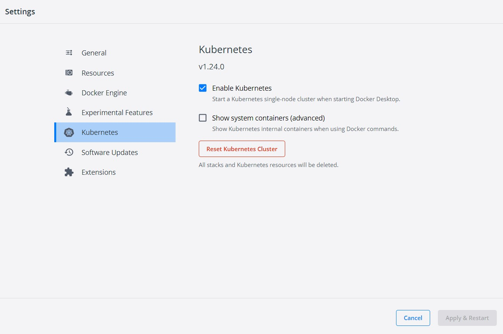

I've been working on gaining a deeper understanding of Kubernetes and refreshing my knowledge on the topic.
I'll be writing several posts over the remainder of the year on Kubernetes.
In my first post I'm going to talk about the basics of running a container in Kubernetes with Docker Desktop.

## Enabling Kubernetes in Docker Desktop

It's simple.
Go to the settings, select the Kubernetes tab on the left, and in the settings click the checkbox to "Enable Kubernetes".
Hit the apply button at the bottom of the settings.
Congratulations, you've got a Kubernetes installation on your machine to work with.



## Kubectl and Tooling

Kubectl is a command line tool that allows making changes to a Kubernetes cluster.
There are other GUI based tools that are helpful too and extensions for popular IDEs and code editors.

* [Lens](https://k8slens.dev/) - A great desktop GUI that gives insights into a cluster.
* [VS Code - Kubernetes Extension](https://marketplace.visualstudio.com/items?itemName=ms-kubernetes-tools.vscode-kubernetes-tools) - Also helps explore a cluster
* [Jetbrains IDEs - Kubernetes Extension](https://plugins.jetbrains.com/plugin/10485-kubernetes)

There are more out there too.
With Kubernetes being as popular as it is, more and more tooling is popping up.

While I am using kubectl to access and make changes, at the core the command line is working with an API Kubernetes exposes.
There are [many client libraries available](https://kubernetes.io/docs/reference/using-api/client-libraries/) to work with the cluster through the API.
So it's possible to automate through code as well as the command line.

## Building a Container

Before I get started, I'm going to need a container to run.
While I can take something directly from [Docker Hub](https://hub.docker.com/) I want to use a container that's built locally.

I've written several posts in the past on bundling applications in containers in the past.
To get started, you really just need a Dockerfile.
A Dockerfile explains how to take an application and bundle it into a container image, and some basic instructions on how the application should run.
For the sake of the rest of this post, I'm just going to point at one example of an application with a Dockerfile.

I have a small Go web service that returns a simple JSON payload.
That can be found here: https://github.com/jerhon/go-greeting-microservice

Clone the repository with git, and build the image with docker.

```
git clone https://github.com/jerhon/go-greeting-microservice
cd go-greeting-microservice
docker build -t greeting-svc .
```

## Contexts

When getting started with kubectl, it's important to understand contexts.
Kubectl can be used to manage multiple clusters.
To know what context is being utilized, run the command ```kubectl config get-contexts```
This will show all the context available.

A context is a combination of:
* How to connect to a cluster
* The credentials to connect to the cluster
* The default namespace that kubectl will be acting in.

> A tip is to alias kubectl to something shorter like just k.
> Kubectl is used a lot when  managing a Kubernetes cluster.
> In my examples, I'll use "k" often instead of kubectl.

For example, running on my machine I have the following contexts available.

```
> kubectl config get-contexts
CURRENT   NAME              CLUSTER           AUTHINFO          NAMESPACE
*         docker-desktop    docker-desktop    docker-desktop
          rancher-desktop   rancher-desktop   rancher-desktop
```

## Namespaces

Kubernetes can divide its workload into namespaces.
A namespace is just a logical grouping of resources in a cluster.
When conducting experiments, a good first step is to create a namespace to play around in.
It keeps Kubernetes tidy and makes cleanup easier.

## Creating a Namespace and Resources Imperatively vs Declaratively

There are a few common ways to create objects in Kubernetes. 
Two ways of these either imperatively via the command line through arguments or declaratively with YAML files.
I'm going to create a namespace for this example.
To create it imperatively via the command line:

```
> kubectl create ns greeting-svc
namespace/greeting-svc created
```

One powerful option on kubectl is its ability to output YAML for the `create` command.

```
> kubectl create ns greeting-svc --dry-run=client -o=yaml
apiVersion: v1
kind: Namespace
metadata:
  creationTimestamp: null
  name: greeting-svc
spec: {}
status: {}
```

That command output the resource as YAML.
I save the output as `greeting-svc.namespace.yaml` I can use the `apply` command to create the resource.
This is the declarative way of creating resources.

```
> kubectl apply -f .\greeting-svc.namespace.yaml
namespace/greeting-svc created
```

The `apply` command is VERY POWERFUL and an easy way to create resources in Kubernetes via files or through some templating system that ultimately generates these YAML files.
There are some really cool more advanced things that can be done with this as a starting point.

The `create` command can also take a file with the `-f` argument.
The `apply` command will both create and update resources.
In the future to make a change to the Pod, I could change the resource file and call the `apply` command to update it.
Not everything in the resource definition can be altered once the Pod has been created, but it's more useful with more advanced resources.

## Running the Pod

A pod is the basic unit of execution in Kubernetes.
One or more containers can be run inside a Pod.

There are all kinds of useful patterns for running more than one container within a Pod.
In this post, I will focus on running just one container inside a pod.

Running the docker container in the docker desktop installation is easy.
After it's been built per the instructions above, the `run` command can be used.
This is a shortcut to create the pod as an alternative to the `create` command above.

```
> k run greeting-svc --image=greeting-svc  --image-pull-policy=Never --port=8080 --namespace=greeting-svc
pod/greeting-svc created
```

To verify the pod has started running, use the `get` command to see the status.

```
> k get pods --namespace=greeting-svc
NAME           READY   STATUS    RESTARTS   AGE
greeting-svc   1/1     Running   0          45s
```

Or if I had additional resources in our namespace, the `get all` command would retrieve them all.

```
> k get all --namespace=greeting-svc
NAME               READY   STATUS    RESTARTS   AGE
pod/greeting-svc   1/1     Running   0          15m
```

The status should be running now.
If it doesn't start up successfully, logs can be obtained by the `logs` command.

```
> k logs pod/greeting-svc --namespace=greeting-svc
```

This application doesn't log anything when it starts up, so there are no logs showing here.

The command line options to output as YAML can be used here as well to get resources.

```
> k run greeting-svc --image=greeting-svc  --image-pull-policy=Never --port=8080 --namespace=greeting-svc -o yaml --dry-run=client
apiVersion: v1
kind: Pod
metadata:
  creationTimestamp: null
  labels:
    run: greeting-svc
  name: greeting-svc
  namespace: greeting-svc
spec:
  containers:
  - image: greeting-svc
    imagePullPolicy: Never
    name: greeting-svc
    ports:
    - containerPort: 8080
    resources: {}
  dnsPolicy: ClusterFirst
  restartPolicy: Always
```

### Important Notes

There are several very important things to note here.

All commands are using the `--namespace` option to specify where they should take place.
It is possible to set the namespace on the context, or to create yet another command alias for the namespace, but those are outside the scope of this post.

The `--image-pull-policy=Never` is EXTREMELY important.
The first time I used Kubernetes in Docker Desktop, I struggled because I couldn't access my locally built images.
Without the argument specified, Kubernetes will try to go out to docker hub and try download an image.
In this case it will fail as there is no "greeting-svc" available on Dockerhub.
Since the image was built locally in via Docker, the Kubernetes cluster running in Docker Desktop can access the image.
In other environments, accessing the image will be different and typically rely on Dockerhub or another container registry.
However, those are outside the scope of this post.

## Accessing the Pod

So far I've created a Pod, and I've set it up so the port on the pod is available.
Since I haven't set up any networking resources to expose this outside the cluster, there's no way to access it yet.
There are a few awesome debugging tricks Kubernetes has up its sleeve in these situations.

### Port Forwards

To access a pod within the cluster, it's possible to forward a port from your local machine out to a pod in the cluster.
This is not meant to be a way to network to Pods in production, but instead as a way to debug in a cluster.
With the running application, run the following command.

```
PS C:\Users\jerho\go\hs-go-microservice-example> k port-forward pod/greeting-svc 5000:8080 --namespace=greeting-svc
Forwarding from 127.0.0.1:5000 -> 8080
Forwarding from [::1]:5000 -> 8080
Handling connection for 5000
```

Now localhost:5000 redirects to port 8080 on the pod.

So long as this window stays open the service can be accessed.

Go to `http://localhost:5000` in the browser, and the JSON from the greeting service will be there.

```
{"greeting":"Hello, world!"}
```

### Proper Networking

This setup is really for debugging.
There are more things that can be done with networking through a Service in Kubernetes, but that's for a later post.

### Running Commands in the Container

Let's say there some situation where I want to troubleshoot a running pod and see what's going on inside the running container.
I can do that with the `k exec` command.

For example, let's list the running processes.

```
> k exec pod/greeting-svc -n greeting-svc -- ps
PID   USER     TIME  COMMAND
1 root      0:00 /app/bin/greeting-svc
16 root      0:00 ps
```

From the ps command you can see the processes running for the container.
If this were a hardened Docker container, I likely would have added a different user for the process to run under than root.
However, this is just meant to be a simple example.

When I say running as root.
I really mean the process inside the container is running as root.
Not that the container has root access on the host machine.
I'm glossing over security the sake of a getting started blog post.

## Cleaning Up the Namespace

Now that I'm done with the Pod, cleaning up is as simple as removing the namespace.

```
> k delete namespace/greeting-svc
namespace "greeting-svc" deleted
```

## Wrapping Up

These are basics of running a container in a Pod in Kubernetes.
Pods are a basic building block.
I'll be highlighting additional key functionality available in Pods and other Kubernetes resources in future posts.
