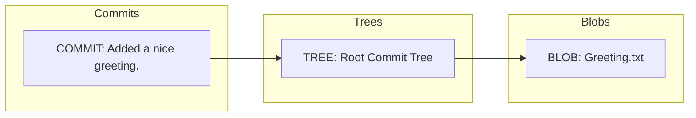
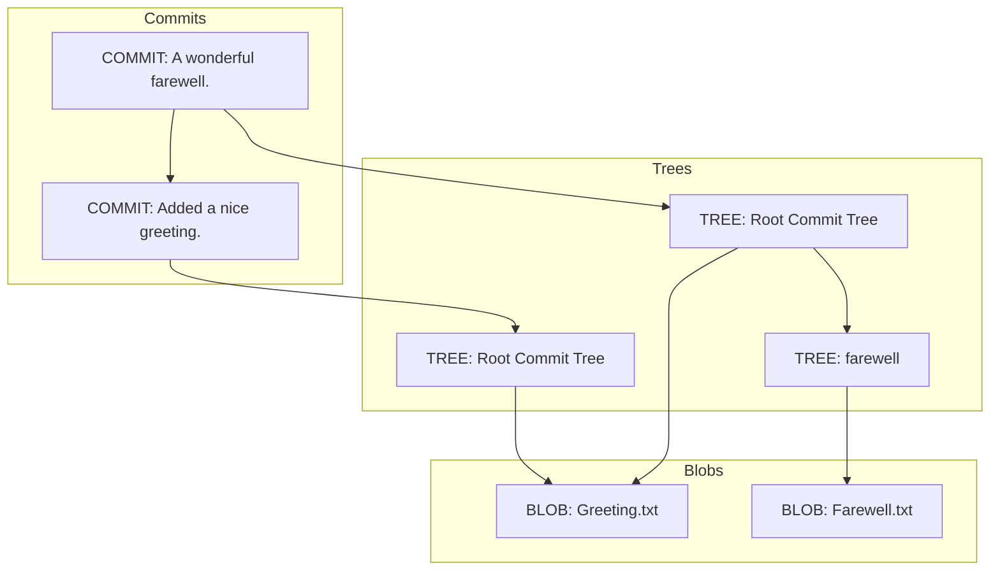
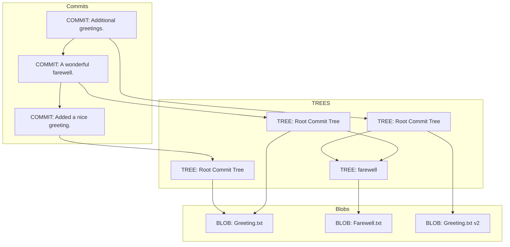

I really like GIT.
I've been using it in some form for the past 10 years.
First to keep personal projects, and later at work.

In [stack overflow surveys of developer](https://insights.stackoverflow.com/survey/2021), GIT it consistently ranks high in usage with 90%+ of surveyed developer utilization using it in the last survey.
Considering the segmentation of developer languages and tools, there are not many tools with that much adoption.

I want to take a look through the internals of how it stores information underneath a commit.
While it's not necessary to know all these details in order to use it, it does demystify what GIT really is.
There are so many version control systems out there and that have been used historically, these details just highlight how different GIT is.

## What is Git

I assume if you're reading this article you likely know what GIT is and have used it at least a few software projects.

At it's core GIT is a version control system.
It stores files and the history of those files to track changes.
It also has several features that make it easier to work on files it controls.
These include things such as branches, tags, and remote repositories.

For this blog, I'm really going to be diving into what the basic objects are that GIT has.

## The Basic Objects

There are three basic objects in GIT that underpin how it's object store.

* blob
* tree
* commit

I think the best way to understand how these work is to look at a few basic examples committing files in a GIT repository.

### Exploring a Basic Git Repository

Let's take a GIT's storage mechanisms in action.
I'm going to start out with a basic git repo with the following commands and commit a single file.

I am using Powershell for all my command line work.

```
mkdir git-internals
cd git-internals
git init
echo "Hello, World!" > "Greeting.txt"
git add Greeting.txt
git commit -m "Added a nice greeting."
```

After all this, we'll have a single file tracked in GIT.
The objects that these operations created are stored under the `.git\objects` directory in the repository.
If I look at the objects, we'll see three of them.
There are a number of other directories, but they aren't important for now.

```
C:\src\git-internals\.git\objects\18\9f46e2b56985a17d751bc8ab9481b07f88a401
C:\src\git-internals\.git\objects\78\ab9cd46fce653c6d9f67555dca8028bc34f50e
C:\src\git-internals\.git\objects\af\5626b4a114abcb82d63db7c8082c3c4756e51b
```

`git rev-list` will give a list of objects currently for HEAD. 

```
PS C:\src\git-internals> git rev-list HEAD --objects
189f46e2b56985a17d751bc8ab9481b07f88a401
78ab9cd46fce653c6d9f67555dca8028bc34f50e
af5626b4a114abcb82d63db7c8082c3c4756e51b Greeting.txt
```

Notice the hashes GIT is using roughly match the files in the directory listing.

Let's take a look at each file that has been created in the repository.
If I just try to open the files, they'll look like a binary mess.
Using the git cat-file command I can look at the actual contents of the file.

The first file is the commit object.

```
> git cat-file -p 189f46e2b56985a17d751bc8ab9481b07f88a401
tree 78ab9cd46fce653c6d9f67555dca8028bc34f50e
author Jeremy Honl <...> 1665203948 -0500
committer Jeremy Honl <...> 1665203948 -0500

Added a nice greeting.
```

The second file is the tree.

```
git cat-file -p 78ab9cd46fce653c6d9f67555dca8028bc34f50e
100644 blob af5626b4a114abcb82d63db7c8082c3c4756e51b    Greeting.txt
```

The third file is the blob, which is the original greeting.

```
> git cat-file -p af5626b4a114abcb82d63db7c8082c3c4756e51b
Hello, world!
```

From the file contents themselves, I can see how the files are put together.
The commit references the tree which references the individual blob.



### The Commit

The commit is an object which links metadata to a snapshot of files.
This includes things like:
* Who committed the file
* When they committed the file
* What are the parent commit(s) of the file
* The tree is associated with the file

Commits are one of the basic units of work in a repository.

Later I will show how commits also link to other commits.

### The Tree

The tree is essentially a listing of the files in the commit and map to a directory.
It includes metadata about files, and their filenames.

I did not include a directory yet in this example, but if I were to do that rather than seeing a blob, we'd see a reference to another tree.

I will show more examples of a tree later in the post.

### The Blob

This is fairly straight forward.
The blob is the contents of the files.

It's the contents of the "Greeting.txt" file, but again note, it is just the contents.
There is no file name associated with the blob.
That type of metadata is kept in a tree.

## Adding a Folder with a File

Now that we've explored a very simple use case, let's make some changes in the repository.
I'm going to explore what adding a folder with a new file does to the objects in the git repository.

```
> mkdir farewell
> cd farewell
> echo "Goodbye, world!" > Farewell.txt
> git add Farewell.txt
> git commit -m "A wonderful farewell."
```

Looking at the objects, I can see there are now 7 objects.

```
> git rev-list HEAD --objects
7e6eb819e978eeb2299333d088f50897c1490ecf
189f46e2b56985a17d751bc8ab9481b07f88a401
2fc4d33d6b5cf481f9dab6108008c9b00631374f
af5626b4a114abcb82d63db7c8082c3c4756e51b Greeting.txt
109415b3d04d9c51e1c58930aeee20352e5f24d3 farewell
c62237e82222b334d66609de729920b6d3ea9a3f farewell/Farewell.txt
78ab9cd46fce653c6d9f67555dca8028bc34f50e
```

Three of the objects are the objects there from the previous commit.
These have not changed.

The key of these objects is GIT's hash of the file contents along with some extra metadata.
If the file had changed, the key would have had to change too.

Let's look at each of these.
First of all, let's start with the commit.
That can be found in the git log.

```
> git log --oneline
7e6eb81 (HEAD -> main) A wonderful farewell.
189f46e  Added a nice greeting.
```

The commit ID is the hash for the commit.
I will start there and trace through the references.

```
> git cat-file -p 7e6eb819e978eeb2299333d088f50897c1490ecf
tree 2fc4d33d6b5cf481f9dab6108008c9b00631374f
parent 189f46e2b56985a17d751bc8ab9481b07f88a401
author Jeremy Honl <...> 1665206981 -0500
committer Jeremy Honl <...> 1665206981 -0500

A wonderful farewell.
```

The commit is much like the previous commit.
Notice that this commit had a parent associated with it.
So, I can see the commit history start to form in a tree structure as well.
The parent commit is the same hash as the initial commit I made.

Let's follow the tree to see what files this contains.

```
> git cat-file -p 2fc4d33d6b5cf481f9dab6108008c9b00631374f
100644 blob af5626b4a114abcb82d63db7c8082c3c4756e51b    Greeting.txt
040000 tree 109415b3d04d9c51e1c58930aeee20352e5f24d3    farewell
```

Note the `Greeting.txt` file is pointing at the same hash as it was in the previous commit.
The tree now references another tree with the name `farewell` matching what I had done earlier.

Let's take a look at that tree.

```
> git cat-file -p 109415b3d04d9c51e1c58930aeee20352e5f24d3
100644 blob c62237e82222b334d66609de729920b6d3ea9a3f    Farewell.txt
```

The tree contains a reference to a single file with its contents. Our `Farewell.txt` file.
If I examine that, it contains the contents of the `Farewell.txt` file that was created.

```
> git cat-file -p c62237e82222b334d66609de729920b6d3ea9a3f
Goodbye, world!
```

This is getting a little complicated, but the overall relationships now look like this between the first and second commit.



While GIT stores a snapshot on every commit, it does a very good job finding duplicate objects and reusing them.

## Changing a File

Let's make a simple change to my greeting and add multiple greetings now.

```
> echo "Hello, world!`nHello, universe!`nHello, multi-verse!`n" > Greeting.txt
> git commit -a -m "Add additional greetings!"
```

Going through the objects that were stored, the repository has 3 new objects.

```
> git rev-list HEAD --objects
4445d480ee211862eb2ab9b8683d93d1f0ef47ed
7e6eb819e978eeb2299333d088f50897c1490ecf
189f46e2b56985a17d751bc8ab9481b07f88a401
840d2d0824a2a91639a3fccdb238b9d6c1926840
9f73f7ae9ea8d63983af1fc0ee15294d4f74cddb Greeting.txt
109415b3d04d9c51e1c58930aeee20352e5f24d3 farewell
c62237e82222b334d66609de729920b6d3ea9a3f farewell/Farewell.txt
2fc4d33d6b5cf481f9dab6108008c9b00631374f
af5626b4a114abcb82d63db7c8082c3c4756e51b Greeting.txt
78ab9cd46fce653c6d9f67555dca8028bc34f50e
```

Again, we'll start at the commit, and work through it's references.

```
> git cat-file -p 4445d480ee211862eb2ab9b8683d93d1f0ef47ed
tree 840d2d0824a2a91639a3fccdb238b9d6c1926840
parent 7e6eb819e978eeb2299333d088f50897c1490ecf
author Jeremy Honl <...> 1665208927 -0500
committer Jeremy Honl <...> 1665208927 -0500

Add additional greetings!
```

The commit looks familiar, and nothing new to note here from the previous example
The parent is the second commit, and the rest of the data matches what I used for the commit.

Next, I will check the tree.

```
> git cat-file -p 840d2d0824a2a91639a3fccdb238b9d6c1926840
100644 blob 9f73f7ae9ea8d63983af1fc0ee15294d4f74cddb    Greeting.txt
040000 tree 109415b3d04d9c51e1c58930aeee20352e5f24d3    farewell
```

This again is familiar, notice the blob on Greeting.txt has changed now because I updated the text in the file.
Note that since I did not change anything in the `farewell` directory it used the same tree.

Again, this is a very important distinction to note.
Even though git is storing a snapshot of all it's files on every commit, it ends up re-using the same objects from previous commits.
For files with duplicate content, it references the same blob.
For trees with duplicate content, it references the same tree.

So, while it sounds scary that it stores a snapshot every time it makes a commit, it's does a very good job at object reuse.

Now, let's see how Git is storing changes to the file.

```
> git cat-file -p 9f73f7ae9ea8d63983af1fc0ee15294d4f74cddb
Hello, world!
Hello, universe!
Hello, multi-verse!
```

That's the full contents of the file.
Certain other version control systems don't store the full file, instead they will store individual changes to the files and piece them together.
GIT is storing the full file.

Here is a graph with the updated relationships for the third commit.
It helps visualize the reuse with the various objects.




### Packfiles

One thing I have left out is the concept of pack files.
Git can store its objects in a more efficient format called a pack file.
In this situation, objects may not be stored directly under the `.git\objects` folder, but instead in the `.git\objects\pack` directory.
However, this is a topic that's out of scope of this blog article.
It's just important to know it's there as a way to optimize the object storage in case you start exploring large repos and are wondering where all the objects went.

## Wrapping Up

GIT has a very interesting system for storing files and keeping tracking of commits in a repository.
Through it's three basic objects it can take a snapshot of all the files in a git repository with minmal costs.

I hope a few of these examples in action has demystified the internals of how GIT stores things.
If you want to learn more about how GIT stores files, [check this page in the GIT documentation](https://git-scm.com/book/en/v2/Git-Internals-Git-Objects).
