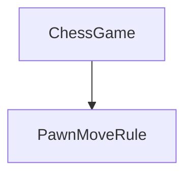
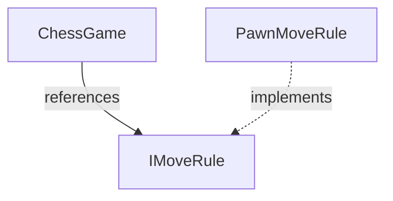
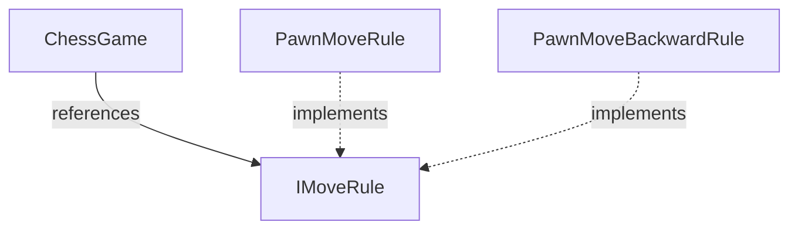

Many branching strategies work to split up work into smaller pieces that are regularly integrated into a mainline branch.
However, often time it is difficult to do this with much larger tasks.

I want to highlight a common software development strategy used to overcome this: Branching by Abstraction.

## What is Branching by Abstraction?

When modifying an area of the system, a contract is introduced which encapsulates the public interface of some functionality to change.
Once the contract is in place, an alternate implementation is created.
This alternate implementation can be worked on in parallel with the existing implementation.
Once the alternate implementation it can be swapped with the previous implementation.

## A Simple Example: A Chess Game

Let's take the implementation of a chess game.
As part of the game there is a rule for determining how pawn pieces can move.
In my code I have decided to divide the rules into individual classes to adhere to SOLID design practices.
However, we want to add more rules that define how pieces can move.

This example is a simple use case.
The complete code for a Chess Game would have much more to it.
This example is just to introduce the concept of branching by abstraction.

In this instance I have a ChessGame, and it depends on a PawnMoveRule to validate whether a particular pawn can move.
The rule is passed in through the constructor.



### The Problem

I would like to add additional rules to this chess game, or I would try a different variant to make chess more fun by allowing pawns to move backwards.

### Step #1: Build an Abstraction

First, I will build an abstraction.



This merely changes the structure of the code, and no functionality.
Rather than this step waiting until the feature is done, it is merged into the trunk.

### Step #2: Create the New Functionality

Now that I have the structure in place that I can extend from, I can add my new rule.
I can commit to the code as much as I want without affecting the existing ChessGame.
Since the ChessGame now references an interface, when my code is done, I can swap in the PawnMoveBackwardRule.



The old implementation and the new implementation can be used interchangeably by the ChessGame.
I can continue to work on the code for my PawnMoveBackwardRule without affecting the existing code.

As I work on the code, I routinely commit it and merge back to the trunk.
This will go hand in hand with unit testing.
I only want to push to trunk when my unit tests pass for the new functionality and old functionality.

### Step #3: Migrate to the New Rule

When the day comes to release the new functionality, the new rule is referenced by the ChessGame.

```csharp
IMoveRule rule = new PawnMoveBackwardsRule();
var chessGame = new ChessGame(rule);
```

## Why?

With a [trunk branching strategy](https://trunkbaseddevelopment.com/), the code can be committed and routinely pushed to the development trunk through pull requests.
Intermediate project changes are safe to deploy with the current version of the application as it doesn't affect the current behavior.

To ensure untested code doesn't reach production, it's important to add unit tests to ensure the behavior works as expected.

### Bonus Step: Introduce a Feature Flag

Let's say I want to get feedback on my feature before it launches and see if people actually like my new rule for moving pawns backwards.
I can introduce a flag in my code which determines which version of my rule to use.


This can be as simple as checking if a feature flag is on and deciding what implementation to use.

```csharp
IMoveRule rule;
if (backwardRuleFeatureFlag.IsOn())
{
    rule = new PawnMoveBackwardsRule();
}
else
{
    rule = new PawnMoveRule();
}

var chessGame = new ChessGame(rule);
```


When this feature ready to become available to the user, it can be done independently of merging the code changes.
It's a matter of going in and flipping that feature flag which is a configuration step rather than a development step.

This includes MANY benefits to the organization, but changes the paradigm of features being release by code changes.
Instead, new features are released through configuration changes.

### Feature Flag Libraries

If you are just getting started with feature flagging, I suggest looking into a library for it.
While it sounds simple, there are many powerful things that can be done and need to be able to be done to make it effective.

[OpenFeature](https://github.com/open-feature) is a great standard for adopting feature flagging.

## Wrapping Up

This was a very simple example of utilizing branching by abstraction to introduce new changes.
This pattern allows us to use continuous integration to introduce changes without needing to have complex branching strategies.

There are many other articles on this.
Here are a few links for more information:

* [Martin Fowler - Branch by Abstraction](https://www.martinfowler.com/bliki/BranchByAbstraction.html)
* [Trunk Based Development - Branch by Abstraction](https://trunkbaseddevelopment.com/branch-by-abstraction/)
