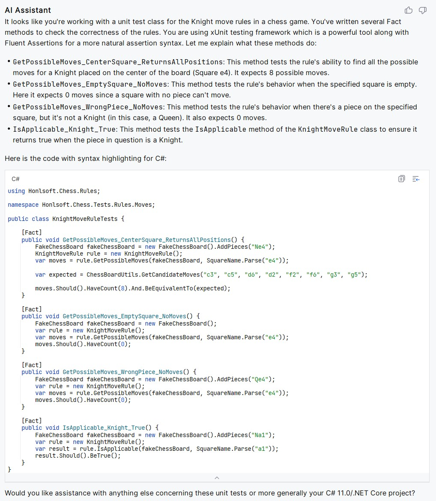
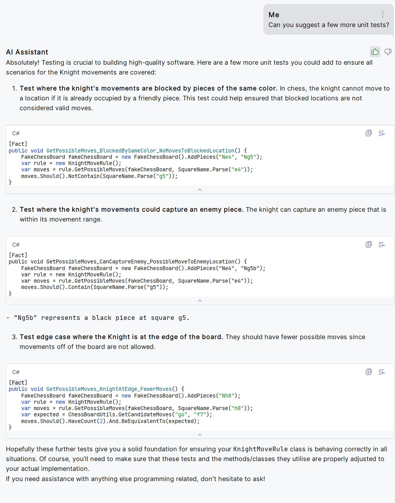

In my pursuit of refining software development methodologies, I have put a few artificial intelligence (AI) assistants to the test.
Initial experiences, were met with mixed results.
They just didn't work well for my personal coding flow.
While the AI system's capabilities extended to elementary code completions at the time, they struggled to deliver when tasked with increasingly complex code structures.

A recent foray into using JetBrains' latest Rider EAP has been a game-changer.
This was my first dose of the practical utility of an AI in a programming environment.
In this article, I will detail my experience with the AI Assistant incorporated within Rider EAP, with a specific emphasis on how it aided my approach to unit testing.

#  The Chess Program

I've been working the past few months on writing a Chess program.
I've been playing chess online this year and wanted to build out a game as a full-fledged project.
It's been a while since I've built a project outside of work from start to finish.
I decided this would be a perfect project I could just work on here and there over the course of the next year or so.
I don't have a lot of time, so having a clear target to focus my efforts on is helpful.

# Unit Testing the Program

One of the great things about building a game like Chess is it's fairly easy to test if it's written well.
However, like much unit testing, while necessary, it can feel somewhat tedious when working through all the various test cases.

This is where AI assistant comes in.

My test coverage is lacking in areas.
So, today I asked the AI assistant to write a few extra unit tests for me based on my existing tests.
I have 4 test that I fed to it, and then asked it to write a few more test cases.

Here's the conversation.

# AI Conversation: Part 1, Interpreting My Tests

For the first part of the conversation, I fed it my code for the unit tests.
I cut off the section where I gave it my code.
You can see in the response it quoted it again.
It's pretty impressive how it was able to understand my code.




# AI Conversation: Part 2, Suggesting Additional Tests

For the second part, I asked it to suggest a few more test cases.
In this case the response wasn't quite on par, but it was still very useful.




# Critiquing the Response

Overall, I was very impressed with what it came up with even if it had a few flaws.
The concepts and test cases it came up with were useful.
However, it had some minor issues in the code it came up with.

I think if the AI were given more context about my project and the APIs, I think it would have been able to overcome these.
However, this is my first attempt.
I was very excited about how well it did.

## Wrong Assertion

In all the tests, it tried to use the following to check if a move works.

```
moves.Should().NotContain(SquareName.Parse("g5"));
```

Which isn't quite right with the API I currently have.
For it to be correct it would need to be more like:

```
moves.Select((m) => m.Square).Should().NotContain(SquareName.Parse("g5"));
```

## Wrong Notation for Pieces

It had used the notation `Ng5b` to refer to a black knight on g5.
However, in my application, I refer to the black knight on g5 with `ng5` instead.

# Wrapping Up

After trying JetBrain's AI Assistant for a week, I think I've only scratched the surface.
I'm going to add all these cases as unit tests to my code base after tweaking them for the minor flaws in them.

I don't think we're in danger of AIs replacing programmers anytime soon.
However, I do believe things like AI Assistant are an excellent tool to help build code.

Oh, and it was also able to help me out with the introduction in this blog post.
