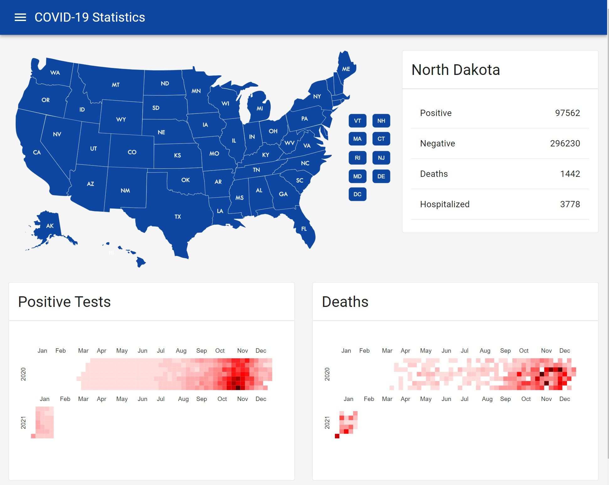

I wrote another COVID-19 app.
This time in React / Redux .NET 5 / EF Core.
The .NET 5 application has several APIs to serve up the data, and hosts a React / Redux single page application to visualize the data.
That data comes from [The COVID Tracking Project](https://covidtracking.com/) and is hosted in an in memory SQL Lite database fronted by EF Core.

This project isn't available on the web as I haven't polished it as much as the previous application.
It's a little rough around the edges from an end user perspective.
It also requires more infrastructure to run since it's utilizing .NET core with a Web API to run.
It was just a way for me to try piecing together several technologies and libraries I've been meaning to dig deeper into.

This web application behaves differently from my first COVID app.
The first app directly used The COVID Tracking Project APIs.
There were certain things it could not do with the API.
Since this app imports the data, it can transform it and present it in different ways.

The real thing I want to visualize were "the waves" of cases.
I did this through a heat map from the excellent [nivo visualization library](https://nivo.rocks/).
From the screenshot below, you can see this in North Dakota's cases.
There was a clear wave of positive cases November-January that has now trended downward.

The app can be run as a docker container.
If you want to give it a try, and have docker installed here's the command line to download and run it.

```docker run --rm -it -p 8080:80 jerhon/hs-covid-app-v3```

Navigate to http://localhost:8080 to see the application.



The source code is available [on GitHub.](https://github.com/jerhon/covid-19-stats-v3)
