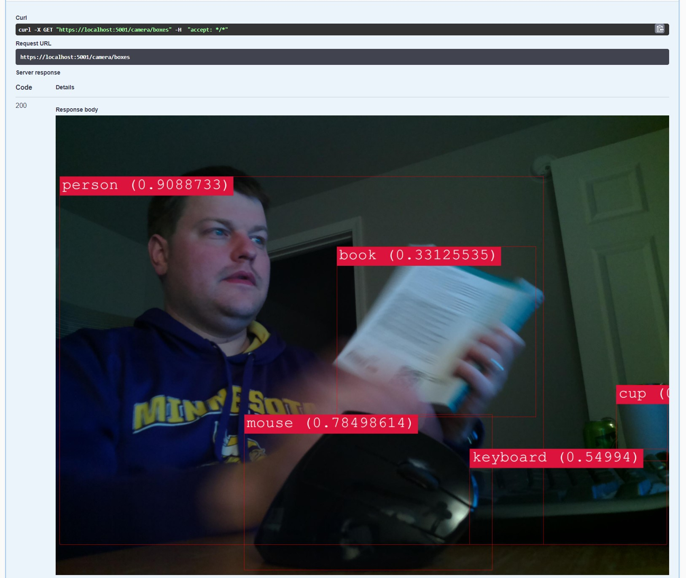

For a while I've been interested in building a project dealing with machine learning.
I had a few projects in mind with my Raspberry PI, but didn't really think about doing it much.
I wanted a fun technology related side project that had nothing to do with my day job.
I had heard of the Microsoft ML.Net library some time ago, but hadn't pieced anything together.

Over the weekend, I decided to give a try setting up a camera on my Raspberry Pi to capture images, and then to perform object detection on the images.

It consisted of two projects I built.

1. A microservice that runs on my Raspberry Pi for capturing images in real time and serve the latest image via HTTP.
2. A microservice that runs on my laptop which performs object detection in real time from the latest image.

The end result is this:

I can hit the endpoint for the object detection microservice, and get the latest image capture from the raspberry pi with object boundaries and object labels.
I was very surprised at how well it detected the objects in the images.
The image above was an accident.
I was just holding up a book, and you can see the camera slipped and got my desk into view.
It successfully detected my mouse, keyboard, and a cup.

I'll be posting a few more articles talking about the architecture of the applications.
In the meantime, the code for the two applications are on GitHub:

* [Github - Raspberry Pi Camera Service](https://github.com/jerhon/hs-pi-camera-service)
* [Github - Object Detection Service](https://github.com/jerhon/hs-object-dectection-service)

